# PRD and Architecture RFC: Global Ingress for AKS Fleet

| Field | Value |
|---|---|
| Document type | Product Requirements Document and Architecture RFC |
| Status | Discussion draft |
| Authors | Fleet Manager, fleet-networking, and AKS representatives |
| Created | 2026-08-06 |
| Reviewers | Fleet Manager networking, fleet-networking, AKS networking, Azure Front Door, security |
| Target | Cross-team product and architecture agreement before implementation |
| Publication | Markdown source, with Mermaid diagrams rendered before Microsoft Word export |

> **Document export note:** Mermaid is the source format for diagrams in
> this RFC. Before exporting to Microsoft Word, render each Mermaid block
> to SVG, or to a high-resolution PNG when the Word conversion tool does
> not preserve SVG reliably. The exported document must contain the
> rendered graphics, not Mermaid source text.

## 1. Executive summary

AKS Fleet does not currently provide one managed product experience
for placing an application across member clusters and exposing it
through the appropriate global ingress service. Fleet's existing
Azure Traffic Manager (ATM) integration provides DNS-based routing to
public endpoints, but it does not provide an HTTP(S) proxy, WAF, edge
TLS termination, host/path routing, or private origin connectivity.
Customers that need these capabilities must assemble and operate Azure
Front Door (AFD), WAF, DNS, certificates, and cluster endpoints
outside the Fleet API.

This document proposes a Fleet-managed global ingress product for
applications deployed across clusters and Azure regions. It uses
provider and connectivity requirements to select the supported data
plane:

| Application requirement | Global ingress direction |
|---|---|
| Public HTTP(S) origins | AFD Standard or Premium |
| Private HTTP(S) origins | AFD Premium + Private Link to PLS |
| Public DNS or non-HTTP endpoints | ATM |
| Private non-HTTP endpoints | Not covered by the current AFD or ATM integrations |

WAF is an optional AFD capability unless a customer or compliance
policy requires it. A first-party compliance class can require AFD
Premium, private origins, an approved WAF policy, and Prevention mode
without imposing those requirements on every external customer.

Fleet Manager remains responsible for application placement across
member clusters. The global ingress integration independently
determines which ready cluster endpoints may receive client traffic.
This separation supports active-active and active-passive regions,
regional evacuation, progressive migration, and traffic-safe cluster
addition or removal.

The initial implementation milestone remains:

> AFD Premium + WAF + Private Link to a Private Link Service (PLS)
> backed by AKS internal load balancers in multiple member clusters.

PR #373 provides useful implementation foundations for that milestone,
including AFD SDK clients, profile, WAF, domain, origin-group,
controller, chart, and test scaffolding. This document defines the
broader product requirements and architecture decisions needed for
external and first-party customers. It does not request approval of
the PR #373 CRDs as the final product API.

## 2. Problem statement

### 2.1 Current state

Fleet customers can place applications across member clusters, but
application placement and global north-south traffic management are
separate operational workflows:

- ATM supports DNS-based global routing to public endpoints.
- Fleet has no managed AFD integration for public or private HTTP(S)
  origins.
- WAF, custom domains, certificates, routes, and AFD health policy are
  managed through separate Azure or infrastructure-as-code workflows.
- Private-origin customers must independently coordinate AFD Premium,
  private endpoints, PLS, AKS internal load balancers, subnet
  capacity, identity, and approval.
- Multi-region placement success does not indicate whether a regional
  endpoint is globally reachable, healthy, secure, or capacity-ready.

### 2.2 Customer and platform pain points

External customers lack a Fleet-native global HTTP(S) ingress
experience comparable to managed multi-cluster ingress products in
other clouds. First-party customers face additional compliance and
network-isolation requirements that cannot be satisfied by the
current public ATM path.

Application and platform teams must currently:

- build custom automation that discovers endpoints as clusters join,
  leave, migrate, or fail;
- reconcile overlapping Kubernetes, Azure, DNS, certificate, WAF, and
  network lifecycles;
- reason about AFD and ATM routing semantics without a common Fleet
  policy or status model;
- prevent public origins from bypassing WAF;
- coordinate private endpoint approval and trusted origin TLS; and
- diagnose failures across several teams without correlated status.

### 2.3 Consequences of not addressing the problem

Without a managed product:

- customers continue building incompatible one-off integrations;
- first-party onboarding remains slow and difficult to audit;
- migration and regional evacuation remain operationally risky;
- Fleet placement cannot provide an end-to-end application readiness
  signal;
- ownership gaps increase incident duration and orphaned-resource
  risk; and
- Fleet remains less integrated than GKE's fleet-aware
  multi-cluster ingress model.

## 3. Decision requested

Fleet Manager, fleet-networking, and AKS should jointly agree on:

1. the supported customer scenarios and product boundary,
2. the Kubernetes API model and its relationship to Gateway API and
   Multi-Cluster Services (MCS) API,
3. the origin model: direct per-Service origins, shared per-cluster
   ingress gateways, or both,
4. resource ownership across Kubernetes and Azure,
5. public-origin and private-origin networking contracts,
6. multi-region traffic and failure semantics,
7. brownfield adoption and rollback,
8. operational ownership, support boundaries, and service objectives,
9. the subscription and tenant placement of AFD, WAF, DNS, and
   related resources, and
10. the phased delivery plan, beginning with first-party PLS.

This RFC does not request approval of the CRDs or controller code from
PR #373. That work is useful implementation evidence, but the product
architecture must be agreed first.

## 4. Terminology

| Term | Meaning in this RFC |
|---|---|
| Fleet | A set of AKS member clusters managed through Azure Kubernetes Fleet Manager. |
| Hub cluster | The Kubernetes control plane that hosts Fleet networking APIs and controllers. |
| Member cluster | An AKS cluster that hosts application workloads. |
| Global ingress | Internet-facing HTTP(S) entry point that routes to workloads in multiple member clusters and regions. |
| ATM path | Existing Fleet DNS-based global load-balancing integration using `TrafficManagerProfile` and `TrafficManagerBackend`. |
| AFD path | Proposed HTTP(S) proxy-based global ingress integration using Azure Front Door Standard/Premium. |
| Origin | An application endpoint to which AFD forwards requests. |
| Origin group | A group of equivalent origins with common probe and load-balancing configuration. |
| Public origin | An origin reachable by AFD through a public endpoint. |
| Private origin | An origin reached by AFD Premium through Private Link. |
| PLS | Azure Private Link Service, commonly attached to an AKS internal load balancer. |
| Ingress gateway | A per-cluster L7 proxy or Gateway API implementation that routes to multiple local Services. |
| Direct Service origin | An AFD origin that targets a load balancer dedicated to one Kubernetes Service. |

## 5. Context and current state

### 5.1 Fleet's existing ATM contract

Fleet currently exposes DNS-based global load balancing through:

- `TrafficManagerProfile`, which creates and configures an Azure
  Traffic Manager profile;
- `TrafficManagerBackend`, which binds a `ServiceImport` to a profile;
- `ServiceExport` weights, which contribute per-cluster endpoint
  weights; and
- public load balancer IP addresses and DNS labels on exported
  Services.

The current v1beta1 API supports:

- the ATM weighted routing method,
- backend and per-cluster weights from 0 through 1000,
- HTTP, HTTPS, or TCP health probes,
- configurable probe paths, ports, intervals, timeouts, tolerated
  failures, and custom headers,
- gradual migration by adjusting weights, and
- one Azure endpoint per eligible exported Service.

The ATM path has important properties:

- Clients resolve DNS and then connect directly to the selected
  cluster endpoint.
- Existing connections are not proxied by ATM and are not moved when
  DNS answers change.
- DNS caching and TTL affect failover and migration time.
- Origins must be publicly addressable in the current Fleet
  implementation.
- ATM does not terminate TLS, evaluate HTTP routes, or provide WAF.
- ATM can support application protocols beyond HTTP(S), because it is
  not in the application data path.

### 5.2 Why AFD is a separate product surface

AFD changes the data path and responsibility model:

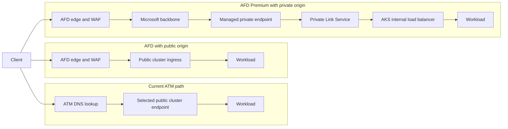

AFD adds capabilities that ATM cannot provide:

- TLS termination at the global edge,
- WAF policy enforcement,
- host- and path-based routing,
- rules and redirects,
- optional caching,
- proxy-level observability,
- session affinity,
- HTTP-aware health and latency routing, and
- private origin connectivity with AFD Premium.

It also introduces new dependencies and failure modes:

- AFD route and domain configuration,
- edge and origin TLS contracts,
- WAF false positives,
- private endpoint approval,
- PLS and subnet capacity,
- origin host-header behavior,
- high probe volume,
- proxy connection limits and timeouts, and
- data-plane behavior when every origin is unhealthy.

### 5.3 Competitive landscape

This section compares product and control-plane patterns, not exact
feature parity. Each provider has different network boundaries,
resource hierarchies, and commercial packaging.

| Dimension | Proposed AKS Fleet experience | GKE | Amazon EKS |
|---|---|---|---|
| Multi-cluster grouping | Fleet Manager member clusters | GKE fleets with a central config cluster | No single equivalent global-ingress control plane; clusters and traffic services are commonly managed separately |
| Kubernetes API direction | Gateway API + MCS `ServiceImport`, with Azure policy objects under evaluation | Hosted Multi Cluster Ingress CRDs and hosted multi-cluster Gateway API; multi-cluster Gateway uses `ServiceImport` backends | AWS Load Balancer Controller manages per-cluster Ingress, Service, and Gateway resources |
| Global HTTP(S) ingress | AFD Standard/Premium across member-cluster origins | Global external multi-cluster Application Load Balancer; regional and cross-regional internal GatewayClasses are also available | Commonly assembled from regional ALBs plus Route 53 or AWS Global Accelerator |
| DNS and non-HTTP global traffic | ATM for public endpoints and protocols not proxied by AFD | Separate Cloud DNS and load-balancing products | Route 53 routing policies or Global Accelerator with ALB, NLB, EC2, or Elastic IP endpoints |
| Private application connectivity | AFD Premium + Private Link to PLS-backed AKS endpoints | Cross-regional or regional internal multi-cluster GatewayClasses, subject to project and VPC topology restrictions | Private ALB/NLB patterns or VPC Lattice for service networking across VPCs and accounts |
| WAF | AFD WAF, optional or policy-required | Cloud Armor on compatible Application Load Balancer backend services | AWS WAF on supported resources such as regional ALBs or global CloudFront distributions |
| Controller operating model | Proposed Fleet-hosted or Fleet-managed controller with explicit ownership still to be decided | Google-hosted multi-cluster ingress/Gateway controllers independent of member-cluster workloads | Per-cluster load balancer controller plus separately managed global traffic services |

#### GKE lessons

GKE demonstrates a strongly integrated model:

- clusters register to one fleet;
- a central config cluster hosts multi-cluster ingress or Gateway
  resources;
- a Google-hosted controller programs shared load-balancing
  infrastructure;
- multi-cluster Gateway uses Gateway API and MCS `ServiceImport`;
- cluster and Pod changes update the global backend set; and
- the product offers explicit GatewayClasses for external, regional
  internal, and cross-regional internal topologies.

Relevant constraints are also instructive:

- multi-cluster Gateway depends on MCS;
- supported backends and topology are determined by GatewayClass;
- clusters must satisfy fleet host-project and VPC restrictions;
- quota and orphaned-resource behavior are documented; and
- config-cluster or regional Fleet control-plane failure can stop
  further programming while the existing load balancer remains.

The primary lesson is that Fleet should expose a coherent
placement-to-ingress workflow and capability classes rather than
requiring customers to assemble raw Azure resources.

#### Amazon EKS lessons

The common EKS model separates local and global traffic management:

- AWS Load Balancer Controller creates an ALB for Kubernetes Ingress
  or Gateway and an NLB for a `LoadBalancer` Service;
- Route 53 provides DNS-based latency, weighted, geolocation, and
  failover policies;
- Global Accelerator directs TCP or UDP traffic through static
  anycast addresses to healthy regional ALB, NLB, EC2, or Elastic IP
  endpoints; and
- VPC Lattice addresses application networking and authorization
  across VPCs and accounts.

This gives customers composable building blocks, but the
multi-cluster application, endpoint, health, and global-ingress
lifecycle is generally assembled across services rather than
represented by one EKS fleet API.

The primary lesson is that Fleet must preserve provider choice between
AFD and ATM while adding enough orchestration and status to avoid an
AWS-style endpoint assembly burden.

#### Implications for this RFC

The competitive comparison supports:

1. using Gateway API and MCS concepts where they fit;
2. separating workload placement from global traffic policy;
3. exposing provider and connectivity capability classes;
4. making controller, hub, and orphan behavior explicit;
5. supporting a managed end-to-end experience rather than only
   documenting how to assemble Azure services; and
6. retaining ATM alongside AFD for DNS and non-HTTP requirements.

## 6. Goals

### 6.1 Product goals

The design should:

1. provide a managed Fleet experience for global HTTP(S) ingress
   across clusters and regions;
2. cover the HTTP(S) scenarios for which customers use ATM today;
3. provide weighted, priority, latency-aware, and health-aware traffic
   management where supported by AFD;
4. support external customers with public or private origins;
5. support first-party customers that require AFD Premium, WAF, and
   Private Link;
6. preserve MCS API compatibility for service export and import;
7. enable safe migration from ATM and independently managed AFD;
8. support both greenfield and brownfield AKS clusters;
9. expose actionable status for Kubernetes, Azure, DNS, certificate,
   WAF, and private-link readiness;
10. avoid requiring application teams to directly orchestrate AFD
    resources with separate ARM/Bicep/Terraform pipelines; and
11. define clear support boundaries among Fleet Manager,
    fleet-networking, AKS, and Azure Front Door.

### 6.2 Initial milestone goal

The first milestone should prove one production-shaped vertical slice:

- AFD Premium profile,
- WAF policy attached in the required mode,
- one custom domain and managed certificate,
- one HTTP(S) route,
- one origin group,
- origins in at least two member clusters,
- AKS internal load balancers with PLS,
- approved AFD-managed private endpoints,
- health-based failover,
- Kubernetes and Azure status visibility, and
- safe creation, update, deletion, and rollback.

The milestone should be deliberately small in API breadth, but it must
use the agreed ownership and lifecycle model.

## 7. Non-goals

This RFC does not propose:

- replacing ATM for arbitrary TCP, UDP, or non-HTTP protocols;
- implementing an AFD-compatible data plane inside AKS;
- replacing east-west MCS connectivity;
- requiring one specific in-cluster ingress implementation for every
  customer;
- provisioning or modifying AKS cluster VNets without explicit
  platform ownership;
- silently adopting arbitrary existing AFD resources;
- guaranteeing zero dropped requests during every failure or
  migration; or
- committing to the CRD shapes prototyped in PR #373.

## 8. Customer personas and scenarios

### 8.1 External customer: managed public multi-cluster ingress

The customer runs an HTTP(S) application in several AKS clusters. They
want Fleet to:

- expose a custom domain,
- terminate TLS,
- route to healthy clusters,
- shift traffic between versions or regions,
- apply WAF policy,
- report status through Kubernetes, and
- avoid a separate global-ingress IaC pipeline.

The origins can be public if the customer accepts and secures that
model. AFD Standard or Premium eligibility depends on the required WAF
and networking capabilities.

### 8.2 External customer: private origins

The customer wants the public edge to be AFD but does not want public
load balancers on clusters. The customer uses AFD Premium with private
origins and accepts the PLS, private endpoint, subnet, approval, cost,
and regional requirements.

### 8.3 First-party customer: compliant private ingress

The customer requires:

- AFD Premium,
- WAF managed rules and required policy settings,
- no public origin endpoint,
- AFD-to-origin connectivity through Private Link,
- auditable identity and policy ownership, and
- explicit compliance status rather than best-effort configuration.

This is the initial delivery scenario. It requires explicit security
and compliance approval that a public AFD edge with no public origin
endpoint satisfies the workload boundary.

### 8.4 Multi-region active-active

The application runs in two or more Azure regions. Healthy origins in
several regions serve traffic concurrently. AFD selects origins using
priority, latency sensitivity, and weights.

The design must explain whether weights express:

- per-cluster traffic intent,
- per-region traffic intent,
- deployment rollout intent, or
- some combination of these.

### 8.5 Multi-region active-passive

One region is primary and another is standby. AFD priorities select
the active region while probes determine failover.

The standby must still be capacity-ready, certificate-compatible, and
network-reachable. The RFC does not treat a successfully reconciled
origin as proof that the standby application has sufficient capacity.

### 8.6 Cluster migration and progressive delivery

Customers must be able to:

- add a replacement cluster at weight zero or low weight,
- validate health before serving production traffic,
- progressively raise weight,
- drain and remove the old cluster, and
- reverse the migration if health or application signals regress.

### 8.7 Regional evacuation

An operator or automated system must be able to remove a region from
traffic without deleting its application. The desired API should
separate:

- administratively disabled,
- health-probe unhealthy,
- cluster not joined or unavailable,
- application not ready, and
- Azure resource not programmed.

### 8.8 User stories

The following user stories describe the intended product outcomes.
They are architecture-level acceptance statements, not final API or
end-to-end test specifications.

| ID | User story | Acceptance outcome |
|---|---|---|
| US-01 | As an external application owner, I want to expose an HTTP(S) application across multiple public member-cluster origins through AFD, so that I receive one global endpoint without operating AFD resources directly. | The application can select AFD Standard or Premium, configure domains and routes, and receive traffic only through healthy eligible origins. |
| US-02 | As an external application owner, I want WAF to be optional for my public AFD application, so that I can adopt global ingress independently and enable the security capabilities my policy requires. | The application can run without an attached WAF policy or reference an allowed WAF policy; status reports the effective WAF attachment and mode. |
| US-03 | As a first-party application owner, I want AFD Premium to reach only private AKS origins through PLS, so that my clusters do not require public workload endpoints. | Every origin uses Private Link, public and private origins are not mixed, and readiness includes PLS discovery and private-endpoint approval. |
| US-04 | As a first-party security owner, I want a policy class to require AFD Premium, private origins, approved WAF managed rules, and Prevention mode, so that compliant applications cannot weaken required controls. | Admission or policy enforcement rejects incompatible tier, connectivity, WAF, or mode selections and reports an actionable reason. |
| US-05 | As an application owner serving a public non-HTTP protocol, I want to continue using ATM, so that clients connect directly through DNS-based global load balancing. | The product selects the ATM path and does not present AFD or WAF as compatible with the workload protocol. |
| US-06 | As a platform operator, I want origin connectivity to be selected independently from AKS private-cluster control-plane configuration, so that public and private workload endpoints are modeled accurately. | Eligibility is based on the actual Service or ingress-gateway endpoint and not inferred from API-server reachability. |
| US-07 | As an application owner, I want healthy clusters in multiple regions to serve traffic concurrently or in priority order, so that I can choose active-active or active-passive deployment. | Priority, latency sensitivity, weight, health, and regional placement are represented and their effective AFD semantics are visible. |
| US-08 | As an operator, I want to evacuate a cluster or region without deleting the application, so that planned maintenance and incident response do not require topology destruction. | Origins can be administratively disabled or drained separately from probe health, membership, and application readiness. |
| US-09 | As an ATM customer, I want to create and validate an AFD path before changing production DNS, so that I can migrate with a bake period and a tested rollback. | ATM and AFD can coexist during migration, DNS cutover is explicit, and the old path remains available until exit criteria are met. |
| US-10 | As a security owner, I want public AFD origins protected from direct client access, so that traffic cannot bypass WAF and edge policy. | The selected public-origin provider enforces or validates the supported origin-lockdown controls and reports noncompliant exposure. |
| US-11 | As a brownfield cluster operator, I want a readiness assessment before enabling private AFD origins, so that unsupported load balancer, PLS, subnet, identity, DNS, and certificate configurations are found before deployment. | The assessment reports blocking and non-blocking findings without silently mutating Day-0 networking choices. |
| US-12 | As a support engineer, I want correlated Kubernetes and Azure status for profiles, domains, routes, origins, WAF, and Private Link, so that I can identify which layer prevents traffic from being ready. | Status, events, metrics, and logs expose stable object and Azure resource identifiers with actionable condition reasons. |

## 9. Capability boundary: AFD versus ATM

### 9.1 Origin-connectivity decision matrix

The product choice should be based on **origin connectivity and
application protocol**, not on whether the AKS API server is configured
as a private cluster. A private AKS cluster can expose a public workload
endpoint, and a non-private AKS cluster can expose only an internal
workload endpoint.

| Origin requirement | Global ingress | Tier | WAF |
|---|---|---|---|
| Private HTTP(S) origin | AFD + PLS | AFD Premium required | Optional as an AFD capability; a first-party or compliance policy can require WAF in Prevention mode |
| Public HTTP(S) origin | AFD | AFD Standard or Premium | Optional; available capabilities depend on the selected tier and policy requirements |
| Public DNS or non-HTTP endpoint | ATM | Not applicable | Not available |
| Private non-HTTP origin | Neither current Fleet AFD nor ATM integration | Not applicable | Not applicable |

Additional constraints:

- AFD Standard does not support Private Link origins.
- Public and private origins cannot be mixed in one AFD origin group.
- Public AFD origins require controls that prevent clients from
  bypassing AFD and its WAF policy.
- WAF requirements should come from a customer or compliance policy
  class rather than being hard-coded for every AFD deployment.
- ATM remains appropriate when clients must connect directly or the
  application protocol is not HTTP(S).

### 9.2 Detailed capability comparison

| Capability | ATM integration | Proposed AFD integration |
|---|---|---|
| Traffic layer | DNS | HTTP(S) reverse proxy |
| Client connection | Direct to selected endpoint | Terminates at AFD edge |
| HTTP host/path routing | No | Yes |
| WAF | No | Yes |
| Edge TLS termination | No | Yes |
| Private origins | Not in current Fleet path | Yes, AFD Premium |
| Non-HTTP protocols | Yes, depending on endpoint | No |
| Weighted traffic | Yes | Yes, subject to AFD latency selection behavior |
| Priority failover | Not exposed by current Fleet API | Yes |
| Latency-aware origin selection | ATM has routing methods, but Fleet currently exposes weighted only | Yes |
| Session affinity | Application/end-origin responsibility | Optional AFD cookie affinity |
| DNS caching impact | Directly affects endpoint failover | Mainly affects custom-domain cutover to AFD |
| Existing connections during failover | Remain with selected endpoint | Remain on the selected AFD-to-origin connection until closed or failed |
| Origin health protocol | HTTP, HTTPS, TCP | HTTP or HTTPS |
| Custom domains/certificates | Customer-managed outside Fleet | Candidate managed surface |
| Caching/rules engine | No | Candidate managed surface |

AFD should be described as the preferred **Fleet L7 global ingress**
option, while ATM remains the Fleet DNS global load-balancing option.

## 10. Proposed architecture

### 10.1 Resource hierarchy

A complete AFD configuration contains several distinct lifecycles:

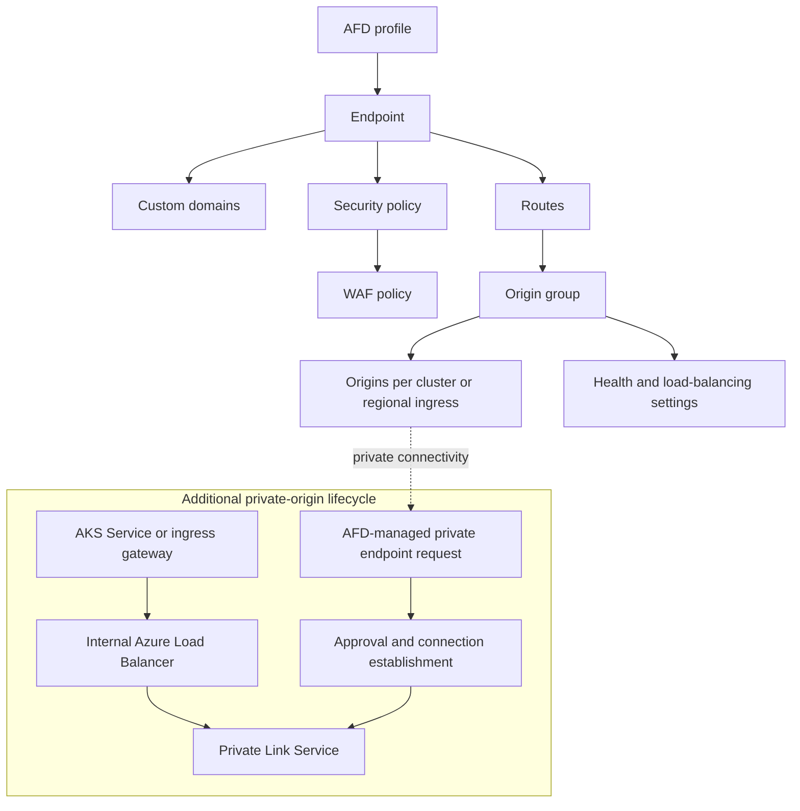

The design must not collapse these into one opaque readiness bit.
Domains, certificates, routes, origins, WAF, and private endpoints can
be independently pending or failed.

### 10.2 Control-plane components

The proposed logical components are:

1. **Fleet API surface**
   - Declares global ingress intent.
   - References MCS `ServiceImport`, Gateway API objects, or another
     agreed workload attachment.
   - Reports product-level status.

2. **Hub global-ingress controller**
   - Resolves Fleet and workload state.
   - Reconciles AFD, WAF attachment, custom domains, routes, origin
     groups, and origins.
   - Does not modify tenant Services without an explicit API contract.

3. **Member origin-discovery controller**
   - Reports eligible origin information from each member.
   - For direct Service origins, observes load balancer and PLS state.
   - For shared ingress gateways, reports the gateway address,
     supported routes, and health prerequisites.

4. **AKS/cloud-provider integration**
   - Owns Kubernetes Service to Azure Load Balancer and PLS
     reconciliation.
   - Defines supported annotations, backend-pool types, subnet
     requirements, health probes, and upgrade compatibility.

5. **Fleet Manager platform integration**
   - Owns feature enablement, cluster eligibility, identity bootstrap,
     policy, regional support, billing/metering integration, and
     customer support entry points.

6. **DNS and certificate integration**
   - Validates domains.
   - Surfaces TXT/CNAME actions when Fleet cannot own DNS.
   - Manages or references certificates according to the agreed
     ownership model.

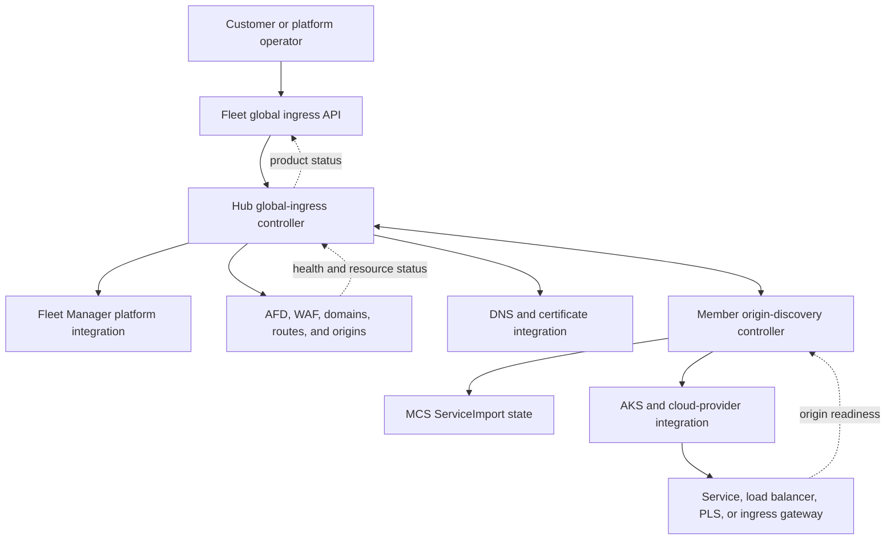

### 10.3 Data plane

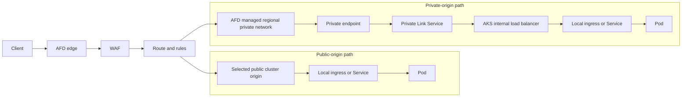

AFD Private Link secures the AFD-to-origin leg. It does not provide a
private client-to-AFD endpoint.

### 10.4 Resource placement and subscription model

The AFD profile, WAF policy, managed private endpoints, DNS
integration, and diagnostic settings must have an explicit
subscription and tenant placement model. Candidate models are:

| Model | Benefits | Costs and risks |
|---|---|---|
| Customer-owned subscription | Direct billing and customer RBAC; natural resource visibility | Cross-subscription controller access, inconsistent policy, customer drift, and support complexity |
| Fleet-managed subscription | Central policy, lifecycle, quota planning, and support | Platform carries cost allocation, tenant isolation, quota, and blast-radius responsibility |
| Split ownership | Customer control of selected WAF, DNS, or certificate resources | More identities, cross-subscription references, deletion rules, and ambiguous incident ownership |

This is a Phase 0 decision. The Phase 1 milestone cannot finalize
identity, quota, billing, deletion, or private-endpoint approval
behavior until the owning subscription and tenant are agreed.

## 11. Origin model

The origin model is the most important open architecture decision.

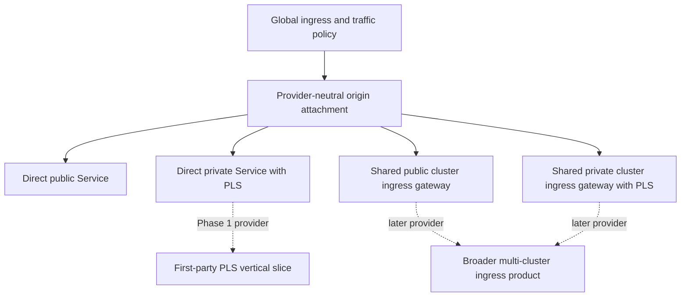

### 11.1 Option A: direct per-Service origin

Each exported application Service has its own load balancer endpoint.
For private mode, it has its own internal load balancer and PLS.

Advantages:

- direct mapping from `ServiceImport` to origins,
- strong workload isolation,
- simple first-party PLS proof,
- independent health and lifecycle,
- no dependency on a shared in-cluster L7 gateway.

Costs and risks:

- Azure load balancer and PLS resource growth per Service,
- subnet NAT IP consumption,
- private endpoint approvals per unique profile/resource/region tuple,
- duplicated probes and configuration,
- application must correctly handle AFD host headers and TLS, and
- limited opportunity to consolidate routes and certificates.

### 11.2 Option B: shared per-cluster ingress gateway

AFD origins point to one or more ingress gateways in each cluster.
Gateway API routes send traffic from the local gateway to Services.

Advantages:

- fewer Azure origins, load balancers, PLS resources, and private
  endpoints,
- natural host/path routing,
- centralized local TLS and policy integration,
- better fit for multi-cluster ingress as a product.

Costs and risks:

- shared failure and tenancy boundary,
- another hop and operational dependency,
- ownership overlap with AKS ingress products,
- route consistency and status aggregation across clusters,
- gateway capacity and noisy-neighbor concerns.

### 11.3 Option C: hybrid origin attachments

The product API represents an **origin attachment** independent of its
implementation. Supported providers can include:

- direct public Service,
- direct private Service with PLS,
- public cluster ingress gateway, and
- private cluster ingress gateway with PLS.

The first milestone implements direct private Service origins. A later
milestone adds a shared gateway provider without changing the global
traffic policy API.

**Recommendation for discussion:** use the hybrid model as the target
architecture and direct PLS as the first provider. Do not encode
Service-specific assumptions into the top-level global ingress API.

## 12. API direction

### 12.1 Principles

The API should:

- preserve upstream MCS `ServiceExport` and `ServiceImport` shapes;
- avoid making users understand the complete ARM resource hierarchy;
- expose portable HTTP routing concepts where Gateway API already
  defines them;
- keep Azure-specific policy in explicit policy or parameter objects;
- provide granular status and observed generation;
- support shared infrastructure without cross-namespace privilege
  escalation;
- make ownership and deletion behavior explicit; and
- allow capability discovery for Standard, Premium, public, and
  private origin modes.

### 12.2 Candidate model

The preferred direction to evaluate is:

1. Gateway API expresses listeners, hostnames, routes, and backend
   references.
2. MCS API expresses which Service is available from which clusters.
3. A Fleet-specific attachment or policy selects clusters, regions,
   traffic policy, AFD tier, WAF policy, and origin connectivity.
4. Status is projected onto standard resources where possible and
   Fleet-specific resources where Azure lifecycle has no standard
   representation.

A conceptual example, not an API proposal:

```yaml
apiVersion: gateway.networking.k8s.io/v1
kind: Gateway
metadata:
  name: contoso-global
  namespace: contoso
spec:
  gatewayClassName: fleet-azure-front-door
  listeners:
  - name: https
    protocol: HTTPS
    port: 443
    hostname: api.contoso.com
    allowedRoutes:
      namespaces:
        from: Same
---
apiVersion: gateway.networking.k8s.io/v1
kind: HTTPRoute
metadata:
  name: api
  namespace: contoso
spec:
  parentRefs:
  - name: contoso-global
  hostnames:
  - api.contoso.com
  rules:
  - backendRefs:
    - group: networking.fleet.azure.com
      kind: ServiceImport
      name: api
---
apiVersion: networking.fleet.azure.com/v1alpha1
kind: AzureFrontDoorPolicy
metadata:
  name: contoso-global
  namespace: contoso
spec:
  targetRef:
    group: gateway.networking.k8s.io
    kind: Gateway
    name: contoso-global
  tier: Premium
  originConnectivity: PrivateLink
  wafPolicyRef:
    name: contoso-waf
  placement:
    strategy: ActiveActive
```

Questions that must be resolved before API approval:

- Is the Gateway API controller owned by Fleet Manager,
  fleet-networking, AKS, or a new component?
- Does one Gateway map to one AFD profile, endpoint, or logical
  configuration within a shared profile?
- Can application namespaces share an AFD profile safely?
- How are cross-namespace references authorized?
- Is WAF policy customer-created, Fleet-created, or both?
- How are cluster selection and per-region policy represented?
- How does a `ServiceImport` become a valid HTTP backend?
- How is direct Service versus shared ingress-gateway attachment
  selected?
- Which fields are portable Gateway API fields and which require an
  Azure-specific policy?

### 12.3 Alternative: Fleet-specific AFD CRDs

Dedicated `FrontDoorProfile`, `FrontDoorRoute`, and
`FrontDoorBackend` CRDs can closely mirror ARM resources and the
existing ATM controller.

This approach is easier to prototype, but it risks:

- creating an Azure-specific API for concepts already present in
  Gateway API,
- coupling users to the ARM hierarchy,
- making shared infrastructure and delegation harder,
- duplicating route status semantics, and
- constraining future ingress-gateway integration.

The CRDs from PR #373 should be treated as a spike for Azure SDK,
status, fake-provider, and reconciliation feasibility, not as the
default API decision.

## 13. Multi-cluster and multi-region traffic model

### 13.1 Separate placement from global ingress

Fleet Manager determines **where the application runs**. AFD or ATM
determines **which eligible member-cluster endpoint receives client
traffic**. These are related but independent control loops.

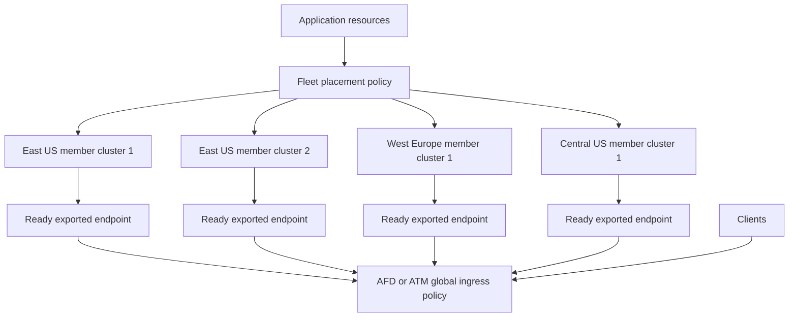

Application placement can use region, cluster, environment, or other
Fleet-supported selection criteria. Global ingress must not infer
traffic eligibility from placement success or Fleet membership alone.

This separation allows:

- an application to be placed before its endpoint receives traffic;
- a cluster to remain in Fleet while being evacuated;
- a replacement cluster to be validated at zero traffic;
- global ingress to retain the last working configuration during a
  placement-controller outage; and
- application rollout and traffic rollout to have independent status
  and rollback.

### 13.2 Member endpoint eligibility

A member cluster becomes eligible for global traffic only after all
required layers are ready:

1. the cluster is joined and selected by placement;
2. application resources are available on the member;
3. workloads satisfy the declared readiness policy;
4. the local Service or ingress gateway has a usable endpoint;
5. `ServiceExport` and `ServiceImport` discovery is complete;
6. public-IP or PLS origin information is available;
7. the AFD origin or ATM endpoint is programmed; and
8. the provider health probe succeeds.

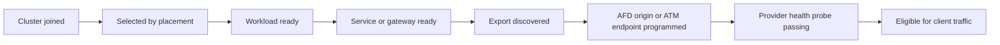

Status should expose each stage separately. A placed application can
be unavailable, and an AFD or ATM endpoint can remain healthy while
the surviving region lacks enough application capacity.

### 13.3 Multi-region interaction with AFD and ATM

| Deployment requirement | AFD behavior | Current Fleet ATM behavior |
|---|---|---|
| Active-active regions | Origins use the same priority; AFD applies health, latency sensitivity, and then weight | Positive-weight public endpoints participate in DNS responses according to ATM weighted routing |
| Active-passive regions | Primary origins use a lower priority number; secondary origins become eligible after primary failure | The current Fleet API exposes weighted routing only; strict priority failover requires an ATM API enhancement or external automation |
| Multiple clusters in one region | Each cluster or shared regional gateway is an origin; weights can represent relative capacity | Each exported public Service is an endpoint with its own weight |
| Regional evacuation | Disable or drain every origin in the region independently from Fleet membership | Set endpoint weights according to the supported drain workflow; DNS caching affects completion time |
| Public HTTP(S) origins | AFD Standard or Premium | Supported, but ATM remains DNS-only and does not provide L7 policy |
| Private HTTP(S) origins | AFD Premium + PLS | Unsupported by the current Fleet ATM integration |
| Public non-HTTP origins | Unsupported by AFD | Supported when the endpoint and health-probe contract are compatible |

AFD and ATM are alternative global-ingress providers for one
application endpoint. They should not be chained together. They can
coexist temporarily during migration, or serve separate HTTP(S) and
non-HTTP endpoints for the same application.

### 13.4 Member-cluster lifecycle

A cluster must be added in readiness order and removed in the reverse
traffic-safe order:

```mermaid
flowchart TB
    subgraph Add["Add member cluster"]
        Join[Join Fleet] --> Select[Select through placement]
        Select --> Deploy[Deploy application]
        Deploy --> Endpoint[Create Service or ingress gateway]
        Endpoint --> Export[Export endpoint]
        Export --> Program[Program AFD origin or ATM endpoint]
        Program --> Probe[Pass health probe]
        Probe --> Enable[Enable production traffic]
    end

    subgraph Remove["Remove member cluster"]
        Disable[Set weight to zero or disable] --> Drain[Wait for drain criteria]
        Drain --> RemoveEndpoint[Remove AFD origin or ATM endpoint]
        RemoveEndpoint --> RemoveExport[Remove ServiceExport]
        RemoveExport --> RemovePlacement[Remove application placement]
        RemovePlacement --> Leave[Remove cluster from Fleet]
    end
```

For ATM, the drain interval must account for DNS TTL and client
caching. For AFD, the drain interval must account for active proxied
connections and configuration propagation.

Removing a cluster from Fleet before removing its global endpoint can
leave stale traffic targeting an application that is being deleted.
The global-ingress controller therefore needs a conservative policy
for unexpected membership loss:

- mark the endpoint administratively ineligible;
- preserve enough identity to delete the Azure resource;
- avoid immediately deleting the last healthy regional endpoint; and
- report whether cleanup, failover, or operator approval is pending.

If the Fleet hub, placement controller, or global-ingress controller
is unavailable, already programmed AFD and ATM data planes should
continue serving their last known configuration. No new cluster,
weight, route, or evacuation changes take effect until reconciliation
resumes.

### 13.5 Origin identity

Every origin should have a stable identity derived from:

- Fleet,
- application or gateway attachment,
- member cluster,
- region,
- origin provider,
- connectivity mode, and
- port/protocol.

The controller must not infer ownership from an ambiguous name prefix
alone. Azure tags and Kubernetes owner status should record the
mapping needed for cleanup and drift detection.

### 13.6 Priority and weight

AFD origin selection is ordered:

1. enabled and healthy origins,
2. lowest priority number,
3. origins inside the configured latency-sensitivity range, and
4. weight among the remaining origins.

This differs from a simple global weighted distribution. A weight is
not guaranteed to produce the requested percentage when origins fall
outside the latency range. At low request rates, observed ratios can
also be skewed.

The API must therefore avoid promising exact global percentages.
Status and documentation should describe weights as relative intent
within AFD's selection algorithm.

### 13.7 Recommended AFD patterns

| Pattern | Priority | Weight | Use |
|---|---|---|---|
| Active-active across regions | Same | Capacity or rollout based | Global availability and performance |
| Active-passive regions | Primary lower number | Usually equal within a tier | Disaster recovery |
| Multiple clusters in one region | Same | Capacity based | Cluster redundancy and scale |
| Progressive delivery | Same | Gradually adjusted | Version or cluster migration |
| Administrative evacuation | Disable origin or set approved policy state | Not relied upon | Planned removal of a cluster or region |

### 13.8 Private Link regional redundancy

For private origins, the **AFD Private Link region** is a separate
choice from the AKS origin region. Microsoft recommends selecting a
supported Private Link region close to the origin.

To tolerate failure of an AFD managed regional private network, a
high-availability design can use origins with different Private Link
regions in the same origin group. This increases private endpoints,
approval operations, status complexity, and cost.

The first milestone should include two origins and should explicitly
decide whether it validates:

- cluster redundancy only,
- origin-region redundancy, or
- both origin and AFD Private Link regional redundancy.

## 14. Health and readiness

### 14.1 AFD health semantics

AFD sends HTTP or HTTPS health probes from its edge environments.
Only `200 OK` is healthy. AFD considers sample size, successful sample
count, and latency.

Probe design implications:

- Probe volume can be high because many edge locations send probes.
- `HEAD` is the default for new profiles, but applications or ingress
  gateways might require `GET`.
- The probe path must test the dependency boundary the customer wants
  to fail over on.
- A liveness-only endpoint can keep traffic on a region whose
  application dependencies are unavailable.
- A deep readiness endpoint can create global failover from a
  transient downstream dependency.

The product should require an explicit probe contract and document
recommended shallow and deep health patterns.

### 14.2 All origins unhealthy

AFD does not fail closed when every origin in an origin group is
unhealthy. It distributes traffic across all origins in round-robin
mode.

This behavior must be:

- documented prominently,
- represented in failure-mode testing,
- considered in application health design, and
- included in incident response guidance.

Fleet status cannot change this platform behavior. It can only make
the condition visible and offer administrative controls.

### 14.3 Readiness layers

The API should distinguish:

1. **Accepted** - configuration is valid and references are authorized.
2. **Programmed** - desired Azure resources were accepted by ARM.
3. **DomainReady** - domain validation and certificate are ready.
4. **WAFReady** - security policy is attached and in the intended mode.
5. **OriginDiscovered** - member endpoint information is available.
6. **PrivateLinkPendingApproval** - AFD requested a private endpoint.
7. **PrivateLinkReady** - connection is approved and established.
8. **OriginHealthy** - AFD reports successful health.
9. **Ready** - the route can serve traffic under the declared policy.

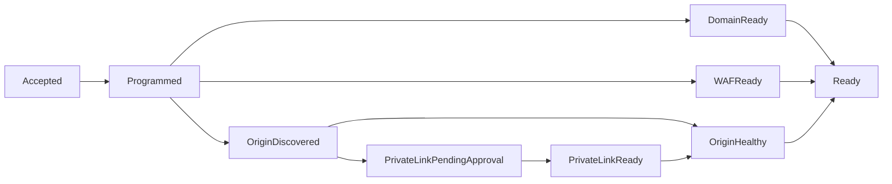

## 15. Networking implications

### 15.1 Public origins

Public origin mode needs a defense against bypassing AFD and WAF.
The design must choose and document supported controls, such as:

- origin access restrictions,
- validation of AFD-provided identifiers or headers,
- network rules that permit AFD but not arbitrary internet clients,
- end-to-end TLS with certificate subject-name validation, and
- disabling unused public listeners.

The controller must not label a route secure merely because WAF is
attached if clients can directly reach the origin.

### 15.2 Private origins

AFD Private Link:

- is available only with AFD Premium,
- creates an AFD-managed private endpoint that the origin owner must
  approve,
- can take several minutes to establish after approval,
- requires a supported AFD Private Link region,
- cannot be mixed with public origins in the same origin group,
- requires certificate subject-name validation for HTTPS origins, and
- does not support client-to-AFD private connectivity.

Within one AFD profile, origins with the same resource ID, group ID,
and Private Link region can share one private endpoint. Changing any
of those values or using another profile creates another endpoint and
approval lifecycle.

### 15.3 AKS internal load balancer and PLS

For the direct Service PLS provider:

- the Service must be `type: LoadBalancer`,
- it must request an internal Azure Load Balancer,
- the cluster must use Standard Load Balancer,
- the backend pool must use a PLS-supported configuration,
- PLS currently supports IPv4,
- subnet and `externalTrafficPolicy` choices affect supportability,
- PROXY protocol changes health-probe requirements, and
- the AKS identity must have the required network permissions.

Subnet planning is a Day-0 concern for constrained environments.
Greenfield guidance should reserve address capacity for:

- load balancer frontends,
- PLS NAT IP configurations,
- growth in exported Services or gateways,
- blue/green migrations, and
- regional redundancy.

Brownfield validation must detect unsupported load balancer, backend
pool, subnet, address-capacity, and policy configurations before
creating AFD resources.

### 15.4 Source IP and proxy headers

Applications no longer receive the client connection directly. The
design must define:

- the trusted proxy chain,
- how client IP is conveyed,
- which forwarding headers applications may trust,
- how to prevent spoofed headers through direct origin access,
- whether PROXY protocol is used between PLS and the AKS load
  balancer, and
- how ingress gateways normalize forwarded headers.

### 15.5 End-to-end TLS

The supported TLS modes should be explicit:

- client-to-AFD TLS is required for production custom domains;
- AFD-to-origin HTTPS is recommended;
- origin certificate subject-name validation remains enabled;
- origin hostname and `Host` header can differ and must be modeled;
- private HTTPS origins must present a certificate from a publicly
  trusted certificate authority whose subject matches the configured
  origin hostname;
- the product contract must define who issues and rotates that
  certificate for an internal-only ingress, including DNS-based
  validation where required;
- customer-managed origin certificates need rotation status; and
- client-certificate mTLS at the AFD edge is not currently a
  generally available product dependency for this design.

## 16. WAF and security ownership

### 16.1 WAF policy modes

The product should support a safe lifecycle:

1. policy attached in Detection mode,
2. logs and false positives reviewed,
3. exclusions or custom rules applied,
4. policy moved to Prevention mode, and
5. compliance policy verifies the required state.

First-party policy can require Prevention mode and approved managed
rule sets. External customers can choose an allowed policy class.

### 16.2 Ownership options

| Model | Benefit | Risk |
|---|---|---|
| Customer supplies WAF policy resource ID | Preserves customer control and existing policy | Cross-subscription RBAC, drift, deletion, and support complexity |
| Fleet creates WAF policy | Consistent lifecycle and status | Fleet owns security configuration and tuning surface |
| Fleet references a platform-managed policy class | Strong governance and simple tenant API | Requires platform service and delegation model |

The initial first-party milestone should prefer a platform-approved
policy reference or class. It should not create an unconstrained WAF
policy API before security ownership is agreed.

### 16.3 Identity separation

The controller identity should use workload identity and least
privilege. Separate responsibilities should be considered for:

- AFD configuration,
- WAF policy read or write,
- DNS changes,
- certificate/Key Vault access,
- PLS discovery and approval, and
- member-cluster network observation.

An AFD identity should not automatically inherit ATM permissions, and
ATM-only installations should not receive AFD write permissions.

## 17. Failure modes and recovery

| Failure | Detection | Data-plane impact | Expected automated behavior | Operator/customer action |
|---|---|---|---|---|
| One pod or node fails | Kubernetes readiness and AFD probe through local origin | Usually none if local load balancer has healthy backends | AKS removes endpoint; AFD keeps origin if probe succeeds | Investigate workload if capacity drops |
| One cluster origin fails | AFD origin health | New requests move to other healthy origins | Keep reconciling desired origin; mark `OriginHealthy=False` | Restore cluster or administratively disable it |
| All origins in one region fail | AFD probes | Traffic moves to healthy origins in other regions | Surface regional degradation | Validate remaining regional capacity |
| Every origin fails probes | AFD health metrics | AFD round-robins across all origins | Surface critical `AllOriginsUnhealthy`; do not claim fail-closed | Incident response; restore at least one origin |
| AFD edge or WAF platform outage | Azure service health, synthetic probes, and client telemetry | Requests can fail before reaching any origin | Preserve origin state; surface platform incident when observable | Follow AFD incident process; use an approved break-glass DNS path if the product supports one |
| AFD Private Link region unavailable | AFD/private endpoint health | Affected private origins unavailable | Use origins configured with another Private Link region if present | Add or recover redundant private-link region |
| PLS not created | Kubernetes Service and Azure discovery | Origin cannot be programmed | Keep origin pending; do not create a public fallback | Fix AKS Service/network prerequisites |
| Private endpoint awaiting approval | PLS connection state | AFD returns errors for that origin | Surface explicit approval token/state | Approve manually or through agreed automation |
| Private endpoint rejected | PLS state | Origin unavailable | Stop retry loop that cannot self-heal; surface rejection | Correct authorization and recreate/request approval |
| PLS NAT IP exhaustion | Azure provisioning error | New private origins cannot be added | Mark network prerequisite failure | Expand/reconfigure subnet or reduce allocation |
| WAF blocks valid traffic | WAF logs and customer telemetry | Requests receive edge rejection | No automatic bypass | Tune exclusion/rule under security process |
| WAF detached or wrong mode | ARM state and policy evaluation | Security posture degraded | Reconcile if controller-owned; mark noncompliant | Restore permission/policy |
| Domain validation pending | AFD domain status | Custom hostname cannot serve | Surface TXT record and expiry | DNS owner creates/updates record |
| Managed certificate issuance fails | Domain/certificate status | HTTPS unavailable on custom domain | Retry according to platform state; preserve last good config | Fix CAA/DNS validation or open support request |
| DNS cutover error | External DNS observation | Traffic reaches old or no endpoint | Do not delete old path until validation gate passes | Correct DNS and use rollback record |
| Origin certificate mismatch | AFD origin TLS failure | Origin unhealthy/unreachable | Keep subject-name validation enabled | Correct hostname or certificate |
| Controller unavailable | Kubernetes deployment health | Existing AFD data plane continues serving | Resume idempotent reconciliation after recovery | Restore controller; inspect drift |
| Hub API unavailable | Kubernetes control plane health | Existing AFD data plane continues serving | No configuration changes until recovery | Restore hub; validate queued changes |
| Azure ARM throttling | SDK errors and metrics | Existing data plane generally unchanged; updates delayed | Backoff with jitter and bounded concurrency | Raise quota/support case if sustained |
| Customer manually edits Azure resource | Drift detection | Depends on edit | Reconcile controller-owned fields; report unsupported conflict for unowned fields | Use Kubernetes API or choose bring-your-own mode |
| Cluster leaves Fleet unexpectedly | Fleet membership and ServiceImport state | Origin can become stale until removed | Disable/remove origin after a conservative policy interval | Confirm intentional removal and cleanup |
| Region capacity shortfall after failover | Application metrics | Increased latency/errors in surviving region | AFD cannot create application capacity | Scale standby and use capacity admission checks |

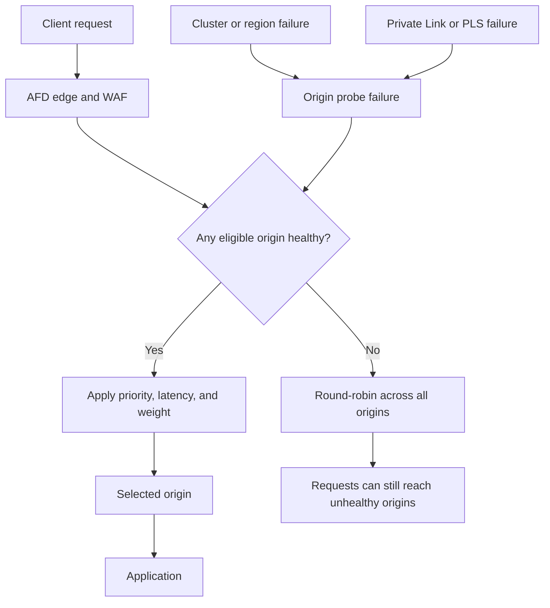

## 18. Brownfield and greenfield adoption

### 18.1 Greenfield

Greenfield guidance should define:

- supported AKS networking modes,
- Standard Load Balancer requirement for PLS,
- VNet and subnet address plan,
- ingress gateway versus direct Service choice,
- workload identity and Azure permissions,
- DNS delegation,
- WAF policy class,
- certificate ownership,
- at least two origins for production,
- regional and Private Link redundancy, and
- observability onboarding.

The platform should validate Day-0 prerequisites before advertising
the feature as enabled for a cluster.

### 18.2 Brownfield AKS clusters

Brownfield enablement should run a readiness assessment:

- load balancer SKU and backend-pool mode,
- available subnet and IP capacity,
- existing public/private Services,
- `externalTrafficPolicy`,
- existing ingress controllers and Gateway API implementations,
- NSGs, UDRs, firewalls, and network policy,
- DNS and certificate ownership,
- identity permissions,
- existing PLS resources and naming,
- unsupported regions or sovereign-cloud differences, and
- application health endpoint behavior.

Some Day-0 networking limitations can require cluster or subnet
replacement. The product must report this clearly rather than
attempting risky automatic mutation.

### 18.3 Migration from ATM

ATM-to-AFD migration is a data-path change, not a controller flag
flip. A safe migration is:

1. keep ATM and its public endpoints serving;
2. create the AFD configuration and separate eligible origins;
3. validate custom domain, certificate, WAF, probes, routing, and
   private connectivity;
4. test through the AFD endpoint without changing production DNS;
5. lower production DNS TTL if appropriate;
6. change the custom-domain CNAME to AFD;
7. monitor errors, latency, WAF blocks, and origin distribution;
8. roll back DNS if acceptance criteria fail;
9. retain ATM for an agreed bake period; and
10. remove ATM resources after the rollback window.

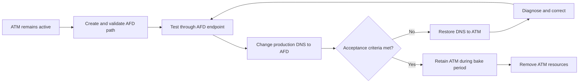

For private-origin migration, the same Kubernetes Service usually
cannot simultaneously satisfy the existing ATM requirement for a
public endpoint and the AFD private-origin requirement. A parallel
Service or ingress gateway is the safer brownfield pattern.

### 18.4 Migration from customer-managed AFD

The first release should not silently adopt an existing profile.
Supported choices should be:

- create a new Fleet-owned profile and migrate DNS,
- reference customer-owned WAF/certificate resources through explicit
  APIs, or
- introduce a future import/adoption workflow with a dry-run,
  ownership inventory, and field-level conflict policy.

## 19. Coexistence and conflict policy

ATM and AFD can coexist:

- in the same Fleet,
- in the same namespace,
- for different applications, and
- temporarily during migration.

The product must prevent accidental double ownership of the same
custom domain, route, or origin attachment.

Recommended conflict rules:

- One custom domain and overlapping path set has one active global
  ingress owner.
- One direct Service attachment cannot be simultaneously treated as a
  public ATM endpoint and a private AFD origin.
- Public and private origins are not placed in the same AFD origin
  group.
- Shared AFD profiles require explicit namespace delegation.
- Deleting a Fleet object cannot delete a customer-owned shared
  profile without an explicit ownership contract.

## 20. Lifecycle and drift

Every Azure resource should be classified as:

- **Fleet-owned** - created, updated, and deleted by the controller;
- **referenced** - created elsewhere, read and attached by Fleet but
  not deleted; or
- **shared** - managed through a separate platform boundary with
  delegated child configuration.

The controller should:

- tag Fleet-owned resources with stable ownership metadata,
- use idempotent create/update operations,
- preserve the last known working data-plane configuration when a new
  desired configuration is invalid,
- expose drift rather than hiding it,
- use finalizers only when cleanup is possible,
- avoid blocking Kubernetes deletion forever on permanent Azure
  authorization failures, and
- define orphan detection and recovery procedures.

## 21. Observability and operations

### 21.1 Kubernetes status and events

Status should include:

- accepted references,
- Azure resource IDs,
- domain and certificate state,
- WAF attachment and mode,
- route programming,
- origin discovery and health summary,
- private endpoint request and approval state,
- observed generation,
- last successful reconciliation, and
- actionable reason/message fields.

Events should identify user-actionable transitions without producing
an event storm on every retry.

### 21.2 Metrics

At minimum:

- reconciliation duration, result, and retry count,
- Azure API latency, throttling, and error codes,
- desired versus programmed profiles/routes/origins,
- pending private endpoint approvals,
- unhealthy origins and all-origins-unhealthy groups,
- domain/certificate expiration or validation state,
- WAF policy compliance state, and
- time from Service export to ready global route.

### 21.3 Logs and diagnostics

The support model must correlate:

- Kubernetes object UID,
- Fleet and member cluster,
- Azure profile/endpoint/route/origin IDs,
- PLS and private endpoint IDs,
- custom domain,
- reconciliation ID, and
- Azure request/correlation IDs.

AFD access, health probe, and WAF logs should integrate with Azure
Monitor. Documentation must explain which logs are customer-owned and
which are platform-owned.

### 21.4 Proposed service objectives

Values require product review, but the RFC should establish metrics
for:

- control-plane availability,
- p50/p95/p99 reconciliation latency,
- time to add or remove an origin,
- time to reflect an administrative traffic change,
- time to detect and route around an unhealthy origin,
- domain and certificate provisioning time,
- private endpoint approval-to-ready time, and
- data-plane availability under the documented redundancy model.

## 22. Scale, quotas, and cost

The design must account for:

- AFD profiles, endpoints, origin groups, origins, routes, domains,
  rule sets, and security policies;
- the composite route limit;
- origins per profile;
- ARM and AFD API throttling;
- PLS and private endpoint counts;
- subnet NAT IP capacity;
- health probe volume;
- WAF policy and rule limits;
- DNS query and managed certificate operations; and
- per-profile versus shared-profile cost attribution.

The controller should use:

- bounded concurrency,
- exponential backoff with jitter,
- change coalescing,
- cached discovery where safe,
- quota preflight checks for predictable limits, and
- status that distinguishes quota exhaustion from transient failure.

Cost attribution should identify at least:

- AFD base/profile costs,
- requests and data transfer,
- WAF policy and processing,
- Private Link and data processing,
- public or internal load balancers,
- PLS NAT allocations,
- logging ingestion, and
- shared ingress-gateway compute.

Shared profiles can improve resource efficiency but complicate
tenancy, blast radius, quotas, and billing. This tradeoff must be a
product decision.

## 23. Team responsibilities

The following is a proposed starting point for discussion.

| Area | Fleet Manager | fleet-networking | AKS / cloud provider | AFD/WAF partner |
|---|---|---|---|---|
| Customer product and support contract | Accountable | Consulted | Consulted | Consulted |
| Fleet feature enablement and cluster eligibility | Accountable | Responsible for signals | Responsible for AKS capability data | Consulted |
| Kubernetes global ingress API | Accountable | Responsible | Consulted | Consulted |
| MCS integration | Consulted | Accountable/responsible | Consulted | Informed |
| AFD/WAF reconciliation | Accountable | Responsible | Informed | Consulted |
| Service-to-LB/PLS reconciliation | Informed | Observes status | Accountable/responsible | Informed |
| VNet/subnet prerequisites | Documents/validates | Consumes capability | Accountable for supported AKS contract; customer owns topology | Consulted |
| Private endpoint approval model | Accountable | Responsible for orchestration | Responsible for PLS state | Consulted |
| DNS and certificate integration | Accountable | Responsible for Kubernetes orchestration | Informed | Consulted |
| Data-plane incident ownership | Accountable for end-to-end triage | Owns controller/MCS layer | Owns AKS LB/PLS layer | Owns AFD/WAF platform layer |
| Security/compliance policy | Accountable | Responsible for agreed API enforcement | Responsible for AKS prerequisites | Responsible for platform controls |

The final RACI must name real owning teams and escalation paths before
preview.

## 24. Phased delivery

### Phase 0: cross-team design and spikes

- Approve this RFC.
- Decide Gateway API versus Fleet-specific API direction.
- Decide direct Service, shared gateway, or hybrid origin model.
- Decide customer-owned, Fleet-managed, or split Azure resource
  placement and subscription model.
- Validate AFD origin/route/WAF SDK behavior.
- Validate AKS PLS prerequisites and brownfield detection.
- Test failure behavior, including all origins unhealthy.
- Establish security, identity, DNS, and certificate ownership.
- Obtain security approval that a public AFD edge with private origins
  satisfies the initial first-party compliance boundary.
- Confirm AFD Premium, WAF, Private Link, and certificate support in
  every targeted public or sovereign cloud.

Exit criterion: Fleet Manager, fleet-networking, AKS networking, and
security reviewers approve the target architecture and Phase 1 API.

### Phase 1: first-party PLS vertical slice

- AFD Premium only.
- One Fleet-owned profile model.
- One approved WAF policy class.
- Direct private Service origin provider.
- Two clusters in two regions.
- One custom domain and managed certificate.
- Defined and tested private-origin TLS issuance and rotation.
- Explicit private endpoint approval workflow.
- Health failover, status, metrics, and cleanup.

Exit criterion: production-shaped end-to-end tests demonstrate private
multi-cluster ingress and documented failure behavior.

### Phase 2: external customer private-origin preview

- Customer-selectable domain and WAF policy options.
- Brownfield readiness assessment.
- Supported migration and rollback.
- Quota and cost reporting.
- Public documentation and support playbook.

### Phase 3: public origins and broader L7 alternative to ATM

- Public-origin hardening contract.
- Standard/Premium capability classes.
- Progressive traffic management.
- ATM coexistence and migration tooling.
- Multi-tenant profile decision implemented.

### Phase 4: shared ingress gateway and Gateway API expansion

- Shared per-cluster origin provider.
- HTTPRoute integration and delegated ownership.
- Route-level policy and advanced traffic features.
- Scale validation for many applications and clusters.

The order of Phases 3 and 4 can change after API and product review.

## 25. Alternatives considered

### 25.1 Keep ATM and require customers to manage AFD separately

Benefits:

- no new Fleet control-plane complexity,
- customers retain full AFD feature access.

Rejected as the strategic direction because:

- customers must reconcile Fleet membership and AFD origins in a
  separate system,
- first-party PLS onboarding remains fragmented,
- Kubernetes status cannot represent global ingress readiness, and
- Fleet cannot offer a coherent multi-cluster ingress product.

### 25.2 Extend the existing ATM CRDs with an AFD mode

Benefits:

- familiar resource names,
- potentially simple migration.

Rejected because ATM and AFD have different data paths, capabilities,
resource hierarchies, health semantics, and security boundaries.
A mode field would create a union API with many invalid combinations.

### 25.3 Mirror every AFD ARM resource as a CRD

Benefits:

- direct SDK mapping,
- maximum AFD feature exposure.

Not recommended as the primary customer API because it couples users
to ARM details and duplicates Gateway API concepts. Lower-level CRDs
could still be implementation or platform APIs.

### 25.4 First-party-only PLS feature

Benefits:

- narrow scope,
- directly addresses the initial requirement.

Rejected as the product boundary because external customers need the
same multi-cluster L7 capabilities, and a first-party-only API risks
locking the implementation to one origin and policy model.

## 26. Risks

| Risk | Impact | Mitigation |
|---|---|---|
| API is designed around the first PLS spike | Difficult expansion to public origins or shared gateways | Approve provider-neutral origin attachment and traffic policy first |
| Gateway API ownership overlaps existing AKS ingress products | Conflicting controllers and customer confusion | Joint AKS/Fleet API review and explicit GatewayClass ownership |
| Shared profiles create tenant blast radius | Security, quota, and lifecycle coupling | Start with isolated ownership; add sharing only with delegation and quota model |
| AFD edge or WAF platform failure affects every request | Global L7 ingress can fail before requests reach healthy origins | Define service dependency, monitoring, incident ownership, and any break-glass DNS strategy |
| Resource subscription and tenant ownership is unresolved | Identity, billing, quota, deletion, and support cannot be finalized | Make resource placement a Phase 0 architecture decision |
| First-party policy rejects a public client-facing edge | Initial private-origin milestone cannot meet its compliance goal | Require explicit security approval before Phase 1 implementation |
| Internal-only origins cannot obtain or rotate a trusted TLS certificate | Private HTTPS origins remain unhealthy or fall back to weaker transport | Define certificate authority, DNS validation, issuance, and rotation ownership |
| Per-Service PLS does not scale economically | Subnet, private endpoint, and cost pressure | Measure Phase 1 and support shared gateway provider in target architecture |
| WAF false positives cause outages | Customer traffic blocked at edge | Detection-first rollout, logs, tuning process, rollback |
| All unhealthy origins still receive traffic | Unexpected application errors during total outage | Document, test, alert, and design meaningful probes |
| Private endpoint approval is operationally slow | Route remains unavailable | Platform-approved automation with auditable policy or clear manual workflow |
| Brownfield networking is incompatible | Adoption requires cluster/subnet changes | Readiness assessment and explicit unsupported findings |
| Public origin allows WAF bypass | Security posture is misleading | Enforce supported origin-lockdown contract |
| Weights are interpreted as exact percentages | Rollouts behave differently than expected | Document AFD priority/latency/weight algorithm and expose effective config |
| Controller deletion or authorization failure orphans Azure resources | Cost and security drift | Ownership tags, orphan inventory, bounded finalizer policy, repair tooling |
| AFD or ARM quotas are reached at Fleet scale | New routes/origins fail | Capacity model, quota preflight, profile sharding strategy |

## 27. Open questions

### Product

1. Is AFD global ingress a Fleet Manager feature, a
   fleet-networking feature, or a separately versioned add-on?
2. Which scenarios are required for public preview and general
   availability?
3. Are AFD Standard and Premium both supported, or does Fleet expose
   Premium only to provide one consistent capability set?
4. What is the support boundary for customer-supplied WAF policies,
   domains, certificates, and AFD profiles?
5. Which subscription and tenant own AFD, WAF, managed private
   endpoints, DNS integration, diagnostics, quota, and cost?
6. Do first-party security stakeholders accept a public AFD edge when
   all origins are private?

### API

7. Does Fleet implement a Gateway API `GatewayClass`?
8. How does an `HTTPRoute` reference a multi-cluster backend?
9. Which resource owns cluster placement, regional priority, and
   per-cluster weight?
10. How are public/private connectivity and origin provider selected?
11. How are shared profiles delegated across namespaces?
12. Which status belongs on Gateway API resources versus
    Fleet-specific policy resources?

### Origin and AKS integration

13. Is direct per-Service PLS acceptable beyond the first milestone?
14. Which shared ingress gateway implementations are supported?
15. Can AKS expose a stable, provider-neutral origin-discovery
    contract instead of Fleet reading implementation annotations?
16. Which AKS networking modes and cluster SKUs are supported?
17. Can private endpoint approval be safely automated, and by which
    identity?
18. Who issues and rotates publicly trusted TLS certificates for
    internal-only private origins?

### Reliability and operations

19. What are the control-plane and data-plane SLOs?
20. What regional redundancy is required for private-link production
    configurations?
21. What is the expected failover time and allowed request loss?
22. Who owns incidents spanning AFD, PLS, AKS load balancer, Fleet,
    DNS, and customer application health?
23. What is the profile-sharding and quota strategy at Fleet scale?
24. Is a break-glass DNS path required for an AFD edge or WAF
    platform outage?

### Migration

25. Is a parallel Service required for every ATM-to-private-AFD
    migration?
26. How long is the supported rollback window?
27. Will Fleet provide automated readiness and migration tooling?
28. Is adoption of existing customer-managed AFD ever supported?

## 28. Review checklist

### Fleet Manager

- [ ] Product scenarios and tiering are agreed.
- [ ] Feature enablement and customer support contract are defined.
- [ ] Shared-resource, billing, quota, and policy ownership are defined.
- [ ] Preview and GA scope are agreed.

### fleet-networking

- [ ] MCS compatibility and service attachment are agreed.
- [ ] API direction is agreed before controller implementation.
- [ ] Status, lifecycle, drift, and cleanup semantics are defined.
- [ ] ATM coexistence and migration are safe.

### AKS

- [ ] Supported load balancer, backend pool, subnet, and PLS contracts are defined.
- [ ] Brownfield readiness checks are feasible.
- [ ] Ingress gateway overlap and Gateway API ownership are resolved.
- [ ] Health probe, source IP, TLS, and networking implications are validated.

### AFD/WAF and security

- [ ] Tier and feature assumptions are correct.
- [ ] Private Link regional and approval models are correct.
- [ ] WAF lifecycle and policy ownership are acceptable.
- [ ] Failure and all-origins-unhealthy behavior are understood.

## 29. References

- [Azure Front Door routing architecture](https://learn.microsoft.com/azure/frontdoor/front-door-routing-architecture)
- [Azure Front Door origins and origin groups](https://learn.microsoft.com/azure/frontdoor/origin)
- [Azure Front Door traffic routing methods](https://learn.microsoft.com/azure/frontdoor/routing-methods)
- [Azure Front Door health probes](https://learn.microsoft.com/azure/frontdoor/health-probes)
- [Azure Front Door Private Link origins](https://learn.microsoft.com/azure/frontdoor/private-link)
- [Connect AFD Premium to an internal load balancer](https://learn.microsoft.com/azure/frontdoor/standard-premium/how-to-enable-private-link-internal-load-balancer)
- [Azure Front Door WAF](https://learn.microsoft.com/azure/frontdoor/web-application-firewall)
- [Azure Front Door domains](https://learn.microsoft.com/azure/frontdoor/domain)
- [Azure service limits](https://learn.microsoft.com/azure/azure-resource-manager/management/azure-subscription-service-limits#azure-front-door-standard-and-premium-service-limits)
- [AKS internal load balancer and PLS integration](https://learn.microsoft.com/azure/aks/internal-lb)
- [MCS API overview](https://multicluster.sigs.k8s.io/concepts/multicluster-services-api/)
- [KEP-1645: Multi-Cluster Services API](https://github.com/kubernetes/enhancements/tree/master/keps/sig-multicluster/1645-multi-cluster-services-api)
- [Gateway API](https://gateway-api.sigs.k8s.io/)
- [GKE Multi Cluster Ingress](https://cloud.google.com/kubernetes-engine/docs/concepts/multi-cluster-ingress)
- [GKE multi-cluster Gateway environment and GatewayClasses](https://cloud.google.com/kubernetes-engine/docs/how-to/enabling-multi-cluster-gateways)
- [GKE Gateway API](https://cloud.google.com/kubernetes-engine/docs/concepts/gateway-api)
- [Google Cloud Armor integration](https://cloud.google.com/armor/docs/integrating-cloud-armor)
- [AWS Load Balancer Controller for Amazon EKS](https://docs.aws.amazon.com/eks/latest/userguide/aws-load-balancer-controller.html)
- [AWS Global Accelerator standard accelerators](https://docs.aws.amazon.com/global-accelerator/latest/dg/about-accelerators.html)
- [Amazon Route 53 routing policies](https://docs.aws.amazon.com/Route53/latest/DeveloperGuide/routing-policy.html)
- [Amazon VPC Lattice](https://docs.aws.amazon.com/vpc-lattice/latest/ug/what-is-vpc-lattice.html)
- [AWS WAF protected resources](https://docs.aws.amazon.com/waf/latest/developerguide/how-aws-waf-works-resources.html)
- [Fleet DNS-based global load balancing](../concepts/DNSBasedGlobalLoadBalancing/README.md)
- [PR #373: initial AFD + WAF + PLS implementation spike](https://github.com/Azure/fleet-networking/pull/373)
