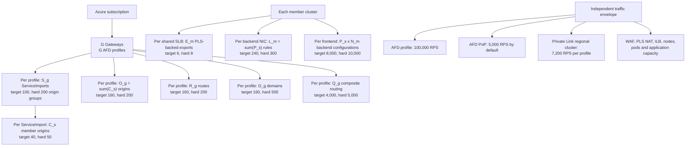
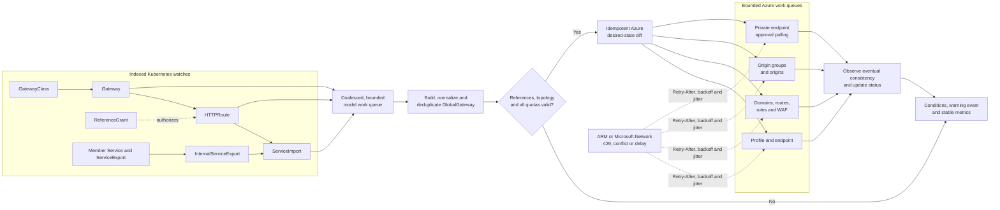
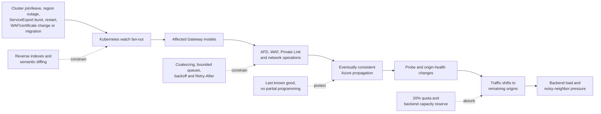
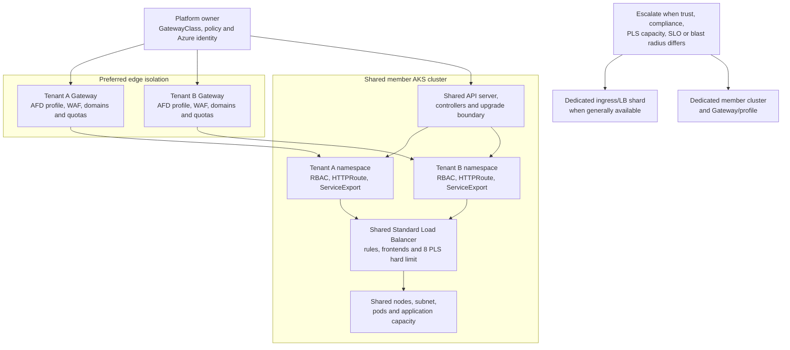
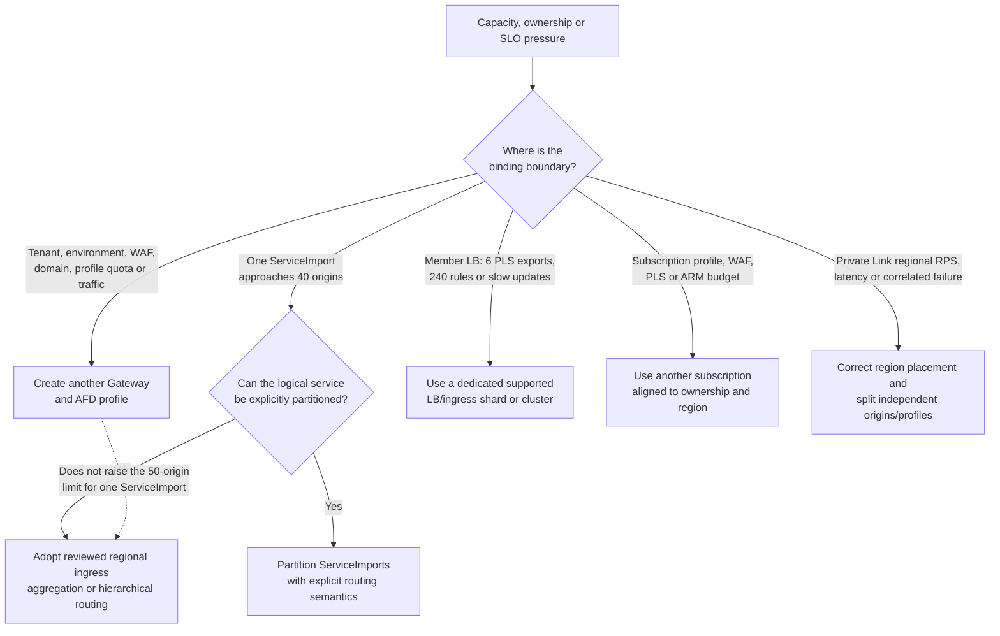
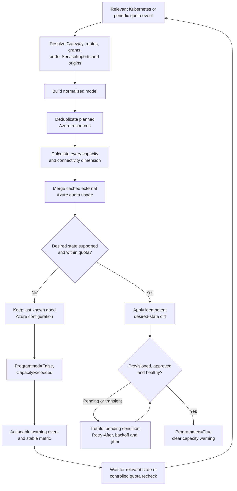
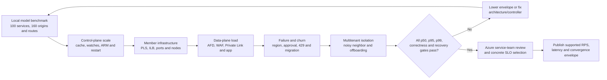

# GEP-1748 Azure Front Door Scale and Capacity

## Status and scope

This document defines the scale model, provisional support envelope, bottlenecks, and validation
plan for the direct-origin architecture described in
[GEP-1748 Gateway API integration](./gep-1748-gateway-api.md). It covers the path:

`Gateway` / `HTTPRoute` -> Fleet `ServiceImport` -> member `ServiceExport` -> internal
`LoadBalancer` `Service` -> Azure Private Link Service (PLS) -> Azure Front Door (AFD) Premium
with optional Web Application Firewall (WAF).

> **Implementation status:** PR #400 is a controller foundation. Its manager validates AFD
> configuration but deliberately registers no Gateway or Azure reconcilers. The resource mappings,
> admission policy, support targets, and tests in this document are requirements for subsequent
> implementation; they are not claims about behavior in the current PR.

```mermaid
flowchart LR
    subgraph Hub["Fleet hub cluster - planned control plane"]
        GC["GatewayClass<br/>fleet-azure-frontdoor"]
        GW["Gateway"]
        HR["HTTPRoute"]
        RG["ReferenceGrant"]
        SI["ServiceImport"]
        ISE["InternalServiceExport<br/>per service and member"]
        MODEL["Normalized GlobalGateway<br/>and capacity preflight"]
        CTRL["Gateway and AFD reconcilers<br/>not yet registered in PR #400"]

        GC --> GW
        GW --> HR
        RG -. authorizes .-> HR
        HR --> SI
        ISE --> SI
        GW --> MODEL
        HR --> MODEL
        SI --> MODEL
        MODEL --> CTRL
    end

    subgraph AzureEdge["Azure global edge"]
        PROFILE["AFD Premium profile<br/>one per Gateway"]
        ENDPOINT["AFD endpoint"]
        DOMAIN["Domains, routes,<br/>rules and certificates"]
        WAF["Optional WAF<br/>security policy"]
        OG["Origin group<br/>one per ServiceImport"]
        ORIGIN["Origin<br/>one per member export"]
        MPE["AFD-managed<br/>private endpoint"]

        PROFILE --> ENDPOINT
        ENDPOINT --> DOMAIN
        WAF --> DOMAIN
        DOMAIN --> OG
        OG --> ORIGIN
        ORIGIN --> MPE
    end

    subgraph Members["Fleet member clusters"]
        SVCEXP["ServiceExport"]
        SVC["Internal LoadBalancer<br/>Service"]
        PLS["Private Link Service<br/>and NAT IPs"]
        ILB["Standard internal<br/>Load Balancer frontend"]
        POD["Ready workload pods"]

        SVCEXP --> ISE
        SVCEXP --> SVC
        SVC --> PLS
        PLS --> ILB
        ILB --> POD
    end

    CTRL -. ARM desired state .-> PROFILE
    MPE --> PLS
    CLIENT["Clients"] --> PROFILE
```



All limits are one of:

- **Hard:** a documented Azure, AKS, or Kubernetes ceiling.
- **Proposed supported:** the initial envelope that Fleet should admit and test.
- **Operational target:** headroom guidance, not an API guarantee.
- **Repository-tested:** a workload that an existing repository test actually exercises.

The proposed supported values remain provisional until the release gates in this document pass and
the owning Azure service teams review the resulting ARM and data-plane measurements.

## Table of contents

- [Comprehensive limits summary](#comprehensive-limits-summary)
- [Capacity model](#capacity-model)
- [Proposed initial support envelope](#proposed-initial-support-envelope)
- [Worked examples](#worked-examples)
- [Why the PR should use this envelope](#why-the-pr-should-use-this-envelope)
- [End-to-end bottleneck analysis](#end-to-end-bottleneck-analysis)
- [Shared member-cluster multitenancy](#shared-member-cluster-multitenancy)
- [Split and sharding guidance](#split-and-sharding-guidance)
- [Admission, status, and recovery](#admission-status-and-recovery)
- [Performance and release-validation matrix](#performance-and-release-validation-matrix)
- [Open validation items](#open-validation-items)
- [References](#references)

## Comprehensive limits summary

`S_g`, `C_s`, `O_g`, `R_g`, `D_g`, `Q_g`, `P_s`, and `E_m` are defined in
[Capacity model](#capacity-model). Limits apply independently; a topology fits only if it satisfies
every applicable row.

| Component/resource | Quota scope | Documented limit or behavior | PR consumption model | Proposed target | Exhaustion symptom | Split or mitigation | Source |
|---|---|---|---|---|---|---|---|
| AFD Standard/Premium profiles | Subscription | 500 profiles | One profile per managed `Gateway` | Keep all managed and unmanaged profiles below 80% of quota | Profile creation fails | Use another subscription for a separate failure and quota domain | [AFD limits] |
| AFD endpoints | Profile | 25 endpoints | Initial design uses one endpoint per `Gateway` | One managed endpoint per profile | Endpoint creation fails | A new `Gateway` creates another profile; do not add endpoints merely to bypass origin limits | [AFD limits] |
| AFD custom domains | Profile | 500 domains | At most one domain per unique attached listener/route hostname; `D_g` after deduplication | `D_g <= 160` until hostname and certificate convergence is tested higher | Domain or association creation fails; certificate rollout stalls | Split domains across Gateways/profiles by tenant, environment, or portfolio | [AFD limits] |
| AFD origin groups | Profile | 200 origin groups | One origin group per distinct referenced `ServiceImport`; `S_g` | `S_g <= 100` | New service backend cannot be programmed | Create another Gateway/profile for different services | [AFD limits] |
| AFD origins | Origin group | 50 origins | One origin per contributing member cluster; `C_s` | `C_s <= 40` | A service cannot add another member-cluster origin | A new profile does **not** help the same service; change topology or explicitly partition the service | [AFD limits] |
| AFD origins | Profile | 200 origins | `O_g = sum(C_s)` over distinct ServiceImport-cluster pairs | `O_g <= 160` | Profile cannot add an origin even if each group is below 50 | Move independent services to another Gateway/profile | [AFD limits] |
| AFD routes | Profile | 200 routes | `R_g` generated after listener, hostname, match, and backend expansion | `R_g <= 160` | Route programming fails or only part of desired routing can be represented | Reject before mutation; split route portfolios across profiles | [AFD limits] |
| AFD composite routing metric | Profile | 5,000, calculated per route as `(HTTP domains * HTTP paths) + (HTTPS domains * HTTPS paths)` and summed across routes | `Q_g` from the exact generated AFD routes, domains, protocols, and paths | `Q_g <= 4,000` | A profile with individually valid route/domain counts is rejected | Prefer HTTPS, wildcard domains where ownership permits, or split route portfolios across profiles | [AFD routing limits] |
| AFD rule sets | Profile | 200 rule sets | Depends on provider lowering of `HTTPRoute` filters and policies | At most 160 generated rule sets; prefer reuse and deterministic deduplication | Filter/policy changes cannot be programmed | Deduplicate rules; move independent routes to another profile | [AFD limits] |
| AFD rules | Route and rule set | 100 rules per route and 100 per rule set | Expansion of path/header/method matches and filters | Preflight generated rules; retain at least 20% headroom | A complex `HTTPRoute` cannot be lowered to AFD | Simplify or split the `HTTPRoute`; do not silently omit rules | [AFD limits] |
| AFD security policies | Profile | 200 security policies | Associations generated from WAF policy and domain scope | At most 160 generated associations | A domain cannot be associated with WAF policy | Reuse policies where ownership permits or split profiles | [AFD limits] |
| AFD profile request rate | Profile | 100,000 requests/second | Aggregate requests through all routes in one Gateway/profile | Treat 70,000 sustained requests/second as an initial alert and capacity-review threshold, not a guaranteed Fleet limit | Throttling, increased latency, or rejected traffic | Scale application origins; request AFD capacity review; shard independent traffic across profiles | [AFD limits] |
| AFD bandwidth | Profile | 75 Gbps | Aggregate response bandwidth through one Gateway/profile | Alert at 70% and load test representative object sizes | Throughput saturation and latency | Split independent traffic or obtain AFD capacity guidance | [AFD limits] |
| AFD request rate | Point of presence (PoP), per profile | 5,000 requests/second by default; support can raise the limit | Hot geography or tenant can saturate one PoP before the global profile | Alert at 70%; test the hottest expected geography | Regional 429 responses despite lower global traffic | Request an increase and isolate hot tenants/properties | [AFD limits] |
| AFD WebSockets | Profile | 3,000 concurrent connections by default | All WebSocket routes in a Gateway/profile share the limit | Do not claim WebSocket scale until separately tested | New or existing connections fail | Dedicated profile and support review for WebSocket workloads | [AFD limits] |
| AFD Private Link protection | Profile and AFD regional cluster | 7,200 requests/second | Private-origin traffic routed through the same AFD regional cluster shares protection capacity | Alert at 70%; validate region placement and request distribution | HTTP 429 from AFD Private Link protection | Use supported Private Link regions near origins; distribute independent origins/profiles; engage AFD for higher scale | [AFD Private Link] |
| AFD managed private endpoints | Profile + resource ID + group ID + Private Link region tuple | One managed private endpoint is created or reused for each unique tuple | Reusing one PLS tuple within one profile avoids duplicates; another profile creates another approval lifecycle | Minimize unique tuples and track approval state explicitly | Pending approval, duplicate approvals, slow convergence | Standardize PLS and region metadata; automate owner notification, not approval bypass | [AFD Private Link] |
| Public/private origin mixing | Origin group | Public and private origins cannot coexist in one origin group | Every member origin for one `ServiceImport` must use a compatible connectivity mode | Require a homogeneous connectivity mode per `ServiceImport` attachment | Origin group cannot be represented | Reject mixed topology or migrate all origins before switching mode | [AFD Private Link] |
| WAF policies | Subscription | 100 policies | Policies may be shared or dedicated by tenant/security boundary | Keep managed and unmanaged policies below 80% of quota | WAF policy creation fails | Reuse only across the same owner and security lifecycle; otherwise split subscriptions | [Azure networking limits] |
| AFD health probes | Origin and AFD edge location | Each edge location can probe an origin; approximate probes per minute are `active edge locations * 60 / interval` | Probe load grows with `O_g`, active regions, and probe frequency | Use `HEAD`, a dedicated constant-time path, and no interval shorter than justified by the SLO; disable probes for a single-origin group unless monitoring value justifies them | Origin CPU/network load, false unhealthy state, control-loop instability | Increase interval, optimize endpoint, and capacity-test probes separately from user traffic | [AFD health probes] |
| AFD origin health | Origin group | Only HTTP 200 is healthy; when all origins are unhealthy AFD round-robins across all origins | Application and network failure can produce fail-open-like distribution to unhealthy origins | Alert on all-origin-unhealthy and make probes representative | Requests continue to unhealthy origins instead of failing closed | Provide application-level overload protection and test total-origin failure | [AFD health probes] |
| Private endpoint connections | PLS | 1,000 connections | Each AFD profile referencing the PLS can create a separate managed private endpoint connection | Keep below 800 and reserve capacity for migration and diagnostics | New private endpoint connection cannot be approved/created | Allocate another PLS/frontend or cluster; remove stale connections | [Azure networking limits] |
| PLS resources | Standard Load Balancer | 8 PLS resources | Normally one PLS-backed exported `LoadBalancer` Service consumes one frontend and one PLS; `E_m` | `E_m <= 6` per shared Load Balancer for the direct private-origin design | Seventh-to-ninth tenant/service collides with migration or hard quota | Use a dedicated cluster/Load Balancer where production multiple-SLB support is unavailable, or adopt a reviewed shared-ingress topology | [Azure networking limits] |
| PLS resources | Subscription | 800 PLS resources | Sum of all member-cluster PLS resources in the subscription | Keep below 80% including non-Fleet resources | PLS creation fails across clusters | Split clusters across subscriptions and preflight regional/subscription quotas | [Azure networking limits] |
| PLS NAT IP configurations | PLS | 8 NAT IP configurations | PLS source NAT capacity and connection scale depend on configured NAT IPs | Size from measured concurrent flows; do not default to the maximum without subnet planning | Port exhaustion, dropped/reset backend connections | Add NAT IP configurations, enlarge subnet, or shard PLS/backend | [Azure networking limits] |
| PLS frontend association | Load Balancer frontend | One PLS per frontend IP configuration | Each direct PLS-backed Service requires a distinct compatible frontend | One owned frontend per direct PLS-backed Service | PLS cannot attach to an already-bound frontend | Add a frontend within LB quota or use another LB/cluster | [Azure networking limits] |
| PLS protocol and idle behavior | PLS data path | IPv4 TCP/UDP; approximately five-minute idle timeout | AFD-to-origin and application connection behavior must fit PLS | Validate keepalive, retry, and long-idle behavior | Long-idle sessions reset; unsupported path cannot be represented | Application keepalive/reconnect; reject unsupported connectivity | [PLS overview] |
| Standard Load Balancer frontends | Load Balancer | 600 frontend IP configurations | Each internal `LoadBalancer` Service typically consumes a frontend; direct PLS uses one per service | Keep below 80%; PLS count binds first for the target topology | Service frontend remains pending or Azure update fails | Another LB/cluster; retire unused frontends | [Azure networking limits] |
| Standard Load Balancer rules | Load Balancer | 1,500 total rules | Each `Service` port creates a load-balancing rule; aggregate `sum(P_s)` | Keep below 1,200 and below the stricter per-NIC limit | Service port cannot be programmed | Reduce ports, shard Services/LBs/clusters | [Azure networking limits] |
| Standard Load Balancer rules | Backend NIC | 300 rules per NIC | Every node participating in the backend pool receives rules for the Services and ports on that LB | `sum(P_s) <= 240` on any participating backend NIC | Azure LB update fails before the total-rule limit | Use fewer exposed ports or a separate LB/node pool/cluster | [Azure networking limits] |
| Standard Load Balancer backend members | Backend pool | 5,000 members | Nodes or backend IPs associated with the LB | Stay within AKS-supported topology; measure update latency well below hard limit | Backend pool update fails or takes excessive time | Shard node pools/LBs/clusters | [Azure networking limits] |
| Standard Load Balancer backend IP configurations | Load Balancer | 20,000 IP configurations | Approximate multiplication of service rules/frontends and participating backends, depending on LB model | Alert and preflight at 80% | Azure LB reconciliation slows or fails | Reduce Services/ports/backends or shard LB/cluster | [Azure networking limits] |
| Standard Load Balancer backend IP configurations | Frontend | 10,000 IP configurations | A frontend serving `P_s` ports across `N` participating nodes can approach `P_s * N` | Require `P_s * N <= 8,000` as planning guidance and verify actual Azure representation | Port-heavy Service on a large cluster cannot update | Reduce ports, narrow backend nodes, or use another LB/cluster | [Azure networking limits] |
| AKS `LoadBalancer` Services | AKS cluster | 300 Services with Standard Load Balancer | All tenants and applications share this cluster ceiling | Keep total below 240; for direct private origins the PLS target of six per shared LB binds much earlier | New Service external IP remains pending; cloud-provider errors | Split workloads or use additional supported LB/cluster topology | [AKS limits] |
| AKS internal LB at large node count | AKS cluster/LB | Microsoft recommends creating an internal `LoadBalancer` Service below approximately 750 nodes because backend pool updates can slow or time out above that size | Every direct origin relies on ILB programming during Service and node churn | Treat 750 nodes as a topology-review trigger | Slow provisioning and delayed or timed-out backend updates | Dedicated ingress node pool/LB or smaller cluster; validate update latency | [AKS large scale] |
| AKS nodes | Cluster | 5,000 nodes; 1,000 nodes per node pool | Node count multiplies LB backend programming and failure churn | This feature should not claim the AKS maximum without end-to-end tests | Long convergence and large failure storms | Partition clusters and use dedicated ingress capacity | [AKS limits] |
| AKS multiple Standard Load Balancers | Cluster | Available as an AKS preview with selector-based placement | Could isolate tenants and distribute PLS resources, but is not a safe required dependency for a production contract while preview | Experimental only until generally available and validated | Rebalancing can disrupt active flows; unsupported production dependency | Prefer dedicated clusters/LBs for hard isolation in the initial production design | [AKS multiple SLBs] |
| Fleet Manager member clusters | Fleet | 1,000 joined clusters | Total Fleet can be much larger than `C_s`; only clusters exporting a referenced service become origins | Do not imply one service can use all 1,000 members directly | Desired service exceeds AFD origin-group capacity | Regional aggregation, hierarchical routing, or explicit service partitioning | [Fleet Manager FAQ] |
| Fleet `ServiceImport.status.clusters` | Kubernetes object | No feature-specific repository admission ceiling today | Object size and update churn grow with `C_s`; Gateway watch fan-out grows with references | Gateway integration admits at most 40 resolved clusters per attached ServiceImport initially | Large status writes, repeated reconciles, AFD capacity rejection | Index references and reject attachment before ARM writes; MCS object may continue to exist | `api/v1alpha1/serviceimport_types.go` |
| Internal export objects | Hub namespace and API server | One `InternalServiceExport` per contributing member export in the existing transport | Fleet-wide object count grows with exported Services times member clusters | Benchmark the intended support tiers; no new global CRD ceiling is proposed by this document | Cache memory growth, watch lag, status write pressure | Selective watches/indexes, pagination, bounded concurrency, cluster/service partitioning | `api/v1alpha1/internalserviceexport_types.go` |
| ARM subscription reads | Subscription + service principal + operation type | Current regional token bucket: 250 tokens, refill 25/second | Uncached GET/LIST, polling, and discovery from all Fleet controllers share the principal's bucket | Keep normal operation below 50% and honor `Retry-After` | HTTP 429, growing work queue, delayed convergence | Cache/index, coalesce work, jitter retries, use separate identities/subscriptions only for real ownership boundaries | [ARM throttling] |
| ARM subscription writes/deletes | Subscription + service principal + operation type | Current regional token bucket: 200 tokens, refill 10/second | AFD, WAF, PLS, LB, domain, and association changes consume writes | Rate-limit below documented refill and serialize conflicting parent-resource updates | HTTP 429, optimistic conflicts, partial convergence | Desired-state diffing, idempotency, bounded concurrency, exponential backoff with jitter | [ARM throttling] |
| Microsoft.Network operations | Subscription/region/provider | 10,000 reads and 1,000 writes/deletes per five minutes | PLS and LB reconciliation shares the network resource-provider budget | Alert at 50%; load test with other cluster operations | HTTP 429 and delayed networking changes | Cache, batch, stagger rollouts, and split subscriptions/regions when operationally justified | [Azure networking limits] |
| Existing member public-IP lookup | Resource group per reconcile | Current controller lists all public IP resources in the resource group and scans for the Service IP | ServiceExport churn multiplies full resource-group LIST operations | Eliminate with cache/indexed lookup before using this pattern for global-ingress scale | ARM read throttling and queue lag | Cache by IP/resource ID and invalidate from Azure/Kubernetes events | `pkg/controllers/member/serviceexport/controller.go` |
| Existing peak performance test | Repository test workload | 80 fleet-scoped service records across four member clusters | Does not exercise AFD resources, PLS approvals, ARM throttling, or the proposed maximum dimensions | Baseline only, not a support claim | False confidence if treated as end-to-end validation | Add the validation matrix below | `test/perftest/latency/peak/latency_test.go` |
| Existing sustained performance test | Repository test workload | 300 EndpointSlices per exporting member cluster, three exporting clusters, 10 workers, 20-minute mutation interval | Exercises existing MCS churn, not Gateway-to-AFD convergence | Baseline only, not a support claim | Same as above | Extend with Gateway, route, origin, ARM, and failure scenarios | `test/perftest/latency/sustained/latency_test.go` |

## Capacity model



For each managed Gateway `g` and referenced ServiceImport `s`:

- `G`: number of managed Gateways and therefore AFD profiles.
- `S_g`: number of distinct ServiceImports referenced by accepted routes attached to Gateway `g`.
- `C_s`: number of member clusters currently contributing an eligible origin to ServiceImport `s`.
- `O_g = sum(C_s)`: number of distinct ServiceImport-cluster origin pairs resolved by Gateway `g`.
  If multiple routes reference the same ServiceImport and port, the provider must deduplicate the
  origin group and origins rather than count them again.
- `R_g`: number of AFD routes generated after listener, hostname, match, filter, and backend
  expansion. `R_g` is not necessarily the Kubernetes `HTTPRoute` count.
- `D_g`: number of unique custom domains generated after listener and route hostname
  deduplication.
- `Q_g`: AFD composite routing metric. For each generated route, add
  `(HTTP domains * HTTP paths) + (HTTPS domains * HTTPS paths)`, then sum all routes.
- `P_s`: number of ports on a member `LoadBalancer` Service.
- `E_m`: number of PLS-backed exported Services using member cluster `m`'s Standard Load Balancer.
- `N_m`: number of nodes participating in that Load Balancer's backend pool.
- `L_m = sum(P_s)`: load-balancing rules contributed by Services sharing that Load Balancer,
  before any provider-specific auxiliary rules.

The direct private-origin model must satisfy at least:

```text
For every ServiceImport s:  C_s <= 50 hard, <= 40 proposed supported
For every Gateway g:        S_g <= 200 hard, <= 100 proposed supported
                              O_g <= 200 hard, <= 160 proposed supported
                              R_g <= 200 hard, <= 160 proposed supported
                              D_g <= 500 hard, <= 160 proposed supported
                              Q_g <= 5,000 hard, <= 4,000 proposed supported
For every shared member LB: E_m <= 8 hard, <= 6 proposed supported
                              L_m <= 300 per backend NIC hard, <= 240 target
For every Service frontend: P_s * N_m <= 10,000 hard planning bound,
                                            <= 8,000 operational target
```

This is a vector, not a scalar. Asking "how many ServiceExports are supported?" is incomplete
without the distribution across Gateways, member clusters, ports, Load Balancers, subscriptions,
Private Link regions, and traffic.

### Resource mapping

| Kubernetes/Fleet state | Planned Azure state | Cardinality consequence |
|---|---|---|
| One managed `Gateway` | One AFD Premium profile and one endpoint | Adds one independent profile quota and blast-radius boundary |
| Unique listener/route hostname | AFD custom domain and route association | Consumes domain, route, certificate, and possibly security-policy capacity |
| Generated route representation | AFD route and optionally rule set/rules | Expansion can make `R_g` larger than the `HTTPRoute` count |
| One distinct `ServiceImport` referenced by a Gateway | One AFD origin group | Consumes `S_g`; references from multiple routes must be deduplicated |
| One eligible member cluster in that ServiceImport | One AFD origin | Consumes both `C_s` and `O_g` |
| One private member backend | Internal LB frontend and PLS | Consumes cluster LB, PLS, subnet, private endpoint, and ARM capacity |
| Another AFD profile referencing the same PLS | Another profile-scoped managed private endpoint lifecycle | Does not consume another PLS resource but does consume another PLS connection and approval |

## Proposed initial support envelope

The following values define what the initial implementation should admit, test, and document as
supported. They deliberately reserve capacity for rolling migrations, temporary duplicate
resources, unrelated subscription resources, and delayed cleanup.

| Dimension controlled by this integration | Proposed supported value | Hard ceiling | Required behavior |
|---|---:|---:|---|
| Contributing member clusters per attached ServiceImport (`C_s`) | 40 | 50 AFD origins/origin group | Reject attachment before ARM mutation when the resolved set exceeds 40 |
| Resolved ServiceImport-cluster pairs per Gateway (`O_g`) | 160 | 200 AFD origins/profile | Reject the new/changed attachment atomically; preserve last known good profile |
| Distinct referenced ServiceImports per Gateway (`S_g`) | 100 | 200 AFD origin groups/profile | Enforce together with `O_g`; do not advertise 100 if route expansion exceeds another limit |
| Generated AFD routes per Gateway (`R_g`) | 160 | 200 AFD routes/profile | Compute from normalized desired state before Azure writes |
| Unique generated custom domains per Gateway (`D_g`) | 160 | 500 AFD domains/profile | Retain conservative certificate and association convergence headroom |
| AFD composite routing metric per Gateway (`Q_g`) | 4,000 | 5,000 | Calculate from the exact generated domain, protocol, and path associations |
| Generated rule sets or security-policy associations per Gateway | 160 each | 200 each/profile | Deduplicate and preflight exact generated cardinality |
| PLS-backed AFD Services/ServiceExports per member shared LB (`E_m`) | 6 | 8 PLS resources/LB | Count Fleet-owned and existing PLS use; reserve two slots for migration/operations |
| Load-balancing rules on any member LB backend NIC (`L_m`) | 240 | 300 | Count all tenants and non-Fleet Services sharing the LB |
| Backend IP configurations per Service frontend (`P_s * N_m` planning bound) | 8,000 | 10,000 | Refuse to claim support based only on Service count; preflight ports and participating nodes |
| Total AKS `LoadBalancer` Services per member cluster | 240 operational target | 300 | The six-PLS target binds first for private direct origins; include all other cluster Services |

These values do not limit Fleet MCS generally. A ServiceImport may exist with more than 40
clusters, and a cluster may have more than six ServiceExports, but that desired state is not
initially supported when attached to this direct AFD Private Link implementation.

No traffic support number is proposed yet. AFD's published rate limits are necessary but not
sufficient: WAF rules, Private Link regional-cluster placement, origin capacity, application
latency, response size, and traffic geography determine the actual envelope. Traffic support must
be published only after the data-plane tests below.

## Worked examples

### Same 200-origin hard limit, different service layouts

All of these consume 200 origins and therefore reach the AFD profile hard limit:

| ServiceImports | Clusters per ServiceImport | `O_g` | Initial support result |
|---:|---:|---:|---|
| 4 | 50 | 200 | Rejected: exceeds both 40 clusters/service and 160 origins/profile |
| 5 | 40 | 200 | Rejected: each service fits, but the profile total does not |
| 10 | 20 | 200 | Rejected: profile total does not fit |
| 40 | 5 | 200 | Rejected: profile total does not fit |
| 200 | 1 | 200 | Rejected: exceeds the proposed 100 services and 160 origins |

Supported examples include:

| ServiceImports | Cluster distribution | `O_g` | Other checks |
|---:|---|---:|---|
| 4 | 40 each | 160 | Fits the AFD support target, but each of the 40 member clusters must also fit its PLS/LB budget |
| 40 | 4 each | 160 | Fits if generated routes, domains, policies, and member LBs also fit |
| 80 | 2 each | 160 | Fits at the origin boundary and leaves 20 ServiceImport slots |
| 100 | 60 services in one cluster and 40 services in 2.5 clusters on average | 160 | Fits only if the integer distribution, routes, and member infrastructure fit |

### Broad service across a 1,000-member Fleet

Fleet Manager can contain 1,000 clusters, but one direct AFD origin group can contain only 50
origins and the proposed support target is 40. A second Gateway/profile repeats the same
origin-group limit; it does not make one global service span 80 clusters as one origin group.

Serving one logical service from all 1,000 clusters therefore requires an architectural change:
regional ingress aggregation, hierarchical routing, explicit and user-visible service
partitioning, or another reviewed origin model. At a target of 40 leaf clusters per aggregation
unit, at least 25 aggregation units would be required before accounting for redundancy and
headroom.

### Ports and nodes can bind before Service count

One Service with five ports across 2,000 participating nodes has a planning multiplication of
`5 * 2,000 = 10,000` backend IP configurations for its frontend. It can reach the documented
per-frontend limit even though the cluster has only one Service and one PLS.

Conversely, six one-port PLS-backed Services on a 100-node cluster consume only six LB rules but
reach the proposed PLS-backed Service target. The seventh may fit Azure's hard PLS limit, but using
it removes the operational slots reserved for migration and repair.

### Representative tiers

| Tier | Gateways/profiles | ServiceImports per profile | Average clusters per ServiceImport | Origins per profile | Interpretation |
|---|---:|---:|---:|---:|---|
| Small | 1 | 10 | 2 | 20 | Functional and low-scale validation |
| Medium | 2 | 50 | 2 | 100 | Multiple profile ownership and normal churn |
| Large supported | 5 | 80 | 2 | 160 | Exercises the proposed origin boundary on every profile |
| Broad-service supported | 1 | 4 | 40 | 160 | Exercises maximum supported fan-out per service |
| Hard-edge negative | 1 | 4 | 50 | 200 | Valid Azure maximum composition that Fleet should reject under the initial support policy |
| Fleet extreme | N/A | 1 logical service | 1,000 | N/A | Requires topology change; direct origins cannot represent it |

## Why the PR should use this envelope

### Forty clusters per ServiceImport

The AFD origin-group ceiling of 50 is the first immutable constraint on one directly mapped
ServiceImport. A target of 40 reserves 20% for controlled migration and avoids operating at a
limit where one cluster addition becomes an outage-causing rejected change. It also gives the
controller a deterministic preflight boundary.

This number is not a claim that 40 is automatically performant. The broad-service test must prove
watch fan-out, ARM update duration, probe load, failover behavior, and origin convergence at 40.

### One hundred ServiceImports and 160 origins per Gateway

AFD allows 200 origin groups, 200 origins, and 200 routes per profile. A 160-origin target reserves
20% of the tightest aggregate quota. Limiting distinct ServiceImports to 100 provides additional
space for route expansion, policy associations, portfolio growth, and blue-green movement while
still supporting the common two-origin-per-service layout at 80 services.

`S_g <= 100` does not supersede `O_g <= 160`. A profile with 100 services at two clusters each is
over capacity, while 80 services at two clusters each fits exactly.

### Six private exported Services per member shared Load Balancer

The most restrictive member-cluster limit for direct private origins is not AKS's 300
`LoadBalancer` Services. It is eight PLS resources per Standard Load Balancer. Reserving two slots
allows a replacement frontend/PLS, migration, or emergency diagnostic path without first deleting
the working configuration.

This makes direct per-Service PLS a low-cardinality topology on a cluster with the normal shared
AKS Load Balancer. A production design that needs dozens of private exported Services per cluster
should not merely raise this number. It should adopt generally available multi-LB isolation or a
shared ingress/PLS aggregation architecture and re-run the security, routing, and performance
analysis.

### Why there is no single Fleet-wide ServiceExport maximum

ServiceExports that are not referenced by an accepted Gateway route consume MCS control-plane
capacity but no AFD origin. Referenced ServiceExports consume capacity in at least three different
scopes:

1. The source member cluster's shared LB and PLS budget.
2. The ServiceImport's origin-group budget.
3. Every Gateway/profile that references that ServiceImport.

A useful support statement must therefore name all three scopes. Fleet-wide totals are suitable
for performance testing and operational dashboards, but not for admission of one Gateway.

## End-to-end bottleneck analysis

### Control-plane path

The planned dependency graph is:



The controller must not list every object on every reconciliation. Required indexes include:

- GatewayClass to Gateways.
- Gateway to attached HTTPRoutes.
- HTTPRoute backend reference to ServiceImport.
- ServiceImport to Gateways/routes that reference it.
- ServiceImport and cluster to InternalServiceExport.
- Azure resource ownership tags/IDs to Gateway UID and normalized child key.

The provider should compute a complete normalized model, validate all cardinalities and
connectivity modes, and only then perform Azure writes. Repeated route references must not
duplicate origin groups, origins, domains, or private endpoint tuples.

Use bounded work queues separately for:

- Kubernetes model reconciliation.
- AFD parent and child resource writes.
- Domain/certificate polling.
- Private endpoint approval-state polling.

All Azure operations must be idempotent, honor `Retry-After`, use exponential backoff with jitter,
and avoid retrying permanent quota or invalid-topology errors. Parent resources that Azure updates
as one document require serialization or optimistic concurrency to prevent lost updates.

The current member ServiceExport public endpoint discovery lists every public IP in the resource
group and scans for the Service IP. Extending that pattern to high-cardinality private ingress
would amplify ARM reads during ServiceExport churn. Cache or index resource IDs and make cache
invalidation explicit before treating this path as scale-ready.

### Kubernetes object and status growth

`ServiceImport.status.clusters` grows linearly with contributing clusters. Origin endpoint,
Private Link resource ID, location, connectivity mode, and weight are carried by internal
per-cluster export state, so model construction and watch fan-out also grow with origin pairs.

Status writes should:

- Write only when semantic condition or observed-generation state changes.
- Avoid embedding complete Azure resources or per-request diagnostics.
- Report the first binding capacity dimension and current/allowed values.
- Aggregate repetitive member errors while retaining per-member metrics and events.
- Preserve valid MCS state even when a Gateway attachment is rejected.

Controller cache memory and API-server watch bandwidth must be measured at Fleet-wide object
counts, not only per-Gateway admitted counts. Selectors should limit the controller to managed
GatewayClasses and relevant namespaces where controller-runtime permits.

### Azure reconciliation and propagation

AFD profile, endpoint, origin group, origin, route, custom domain, WAF association, and managed
private endpoint operations are eventually consistent and do not complete as one transaction.
The controller must distinguish:

- Desired state accepted but Azure provisioning is in progress.
- A private endpoint awaiting owner approval.
- A transient ARM throttle or conflict.
- A permanent Azure quota or unsupported topology.
- A partial Azure state left by a failed operation.

Capacity preflight prevents predictable partial programming. It cannot eliminate mid-flight quota
changes from other actors, so rollback or fail-static behavior is still required. Azure resource
ownership tags and deterministic names are necessary for safe discovery after controller restart.

Published ARM and Microsoft.Network throttles are shared with other resources in the same scope.
Large cluster joins, node upgrades, Service changes, and Gateway updates can coincide. Reconcile
concurrency should be tuned from measured request rate and latency, not increased until queues
appear short.

### Data-plane path

```mermaid
flowchart LR
    CLIENT["Client requests"] --> POP["AFD edge PoP<br/>5,000 RPS/profile default"]
    POP --> PROFILE["AFD profile<br/>100,000 RPS and 75 Gbps"]
    PROFILE --> WAF{"WAF enabled?"}
    WAF -- Yes --> INSPECT["WAF inspection"]
    WAF -- No --> ROUTE["AFD route"]
    INSPECT --> ROUTE
    ROUTE --> OG["Origin group<br/>one ServiceImport"]
    OG --> ORIGIN["Selected member origin"]
    ORIGIN --> REGIONAL["AFD Private Link<br/>regional cluster<br/>7,200 RPS/profile"]
    REGIONAL --> MPE["Managed private endpoint"]
    MPE --> PLS["Member PLS<br/>NAT IP and connection capacity"]
    PLS --> ILB["Internal Standard LB<br/>frontend, rule and backend pool"]
    ILB --> SVC["Kubernetes Service"]
    SVC --> POD["Ready pod<br/>application capacity"]
    POD --> CLIENT

    PROBE["AFD edge health probes"] -. same private path .-> REGIONAL
    PROBE -. HEAD health check .-> POD
```



The main independent boundaries are:

- AFD profile, PoP, WebSocket, route, origin, and domain quotas.
- WAF policy complexity and subscription policy count.
- AFD Private Link regional-cluster protection and region selection.
- PLS connection, NAT IP, idle timeout, and per-LB resource limits.
- Standard Load Balancer frontend, rule, backend, and update latency limits.
- Node, pod, application connection, CPU, and readiness capacity.

The feature must not equate a healthy Azure resource with an application-ready origin. AFD probes
must traverse the same private path as production and terminate on a lightweight endpoint that
checks only dependencies required to serve traffic.

### Probe amplification

For `A` active AFD edge locations, `O` origins, and an interval of `I` seconds, a useful upper-bound
planning estimate is:

```text
probes per minute ~= A * O * (60 / I)
```

Actual AFD behavior and active edge count vary, so the implementation must observe probe traffic
rather than hard-code this estimate. At 30 seconds, each active edge can produce roughly two
probes per origin per minute. Multiplying by 160 origins can create meaningful always-on traffic
before any user request arrives.

Use `HEAD`, avoid authentication and expensive dependency fan-out, return HTTP 200 only when the
origin should receive traffic, and test regional and all-origin failure. Because AFD routes across
all origins when all are unhealthy, overload controls and application retries remain necessary.

### Churn and failure storms



| Trigger | Amplification | Expected risk | Required mitigation |
|---|---|---|---|
| Member cluster join/leave | Every referenced ServiceImport and Gateway using that member may change | Origin and status write burst | Reverse indexes, work coalescing, bounded Azure writers |
| Region outage | Many probes fail and origin health changes together | Traffic concentrates on remaining origins; application overload | Capacity reserve, regional distribution, load shedding, failover test |
| Mass ServiceExport update | Internal exports, ServiceImports, Gateways, and ARM desired state all change | Kubernetes and ARM queue growth | Semantic diffing, debounce/coalesce, token-aware rate limit |
| Controller restart | Cache warm-up and Azure discovery for all owned Gateways | LIST/GET burst and delayed status | Staggered resync, ownership index, bounded discovery |
| WAF policy update | Many domains/routes may share one policy | Wide traffic-policy blast radius | Dedicated policy/profile for independent owners; staged rollout |
| Certificate renewal | Domain validation and deployment across many hostnames | Partial HTTPS readiness | Per-domain state, early renewal, capacity and expiry alerts |
| Private endpoint approval delay | AFD origin exists but private path is not ready | Gateway remains unprogrammed; probes fail | Explicit pending condition, owner notification, no false success |
| Blue-green fleet migration | Old and new origins overlap | Temporary origin and PLS quota spike | Reserve 20% headroom; batch migration below both old/new budgets |

## Shared member-cluster multitenancy

Several teams can share one member AKS cluster, but namespace isolation does not isolate AFD
quotas, Standard Load Balancer resources, PLS resources, subnets, nodes, Kubernetes API capacity,
controller queues, Azure identities, costs, or failure domains.



### Supported patterns

| Pattern | Isolation provided | Shared risks | Recommendation |
|---|---|---|---|
| Shared cluster, dedicated namespace, dedicated Gateway/AFD profile per tenant | Kubernetes names/RBAC plus edge quota, WAF, domain, and profile blast-radius separation | Cluster API, nodes, default SLB, PLS count, subnet, cloud-provider queue | Default shared-cluster pattern for independent groups with compatible cluster trust and low PLS cardinality |
| Shared cluster and shared AFD profile with dedicated listeners/domains/routes | Logical route and domain separation | All profile quotas, policy updates, ARM parent updates, traffic saturation, owner lifecycle | Only for one administrative/security owner and shared SLO; not the default for independent tenants |
| Shared cluster with dedicated ingress/LB/PLS shard | Edge and member ingress capacity separation | Cluster control plane and possibly nodes/subnets | Desirable when a generally available and validated LB/ingress sharding mechanism exists |
| Dedicated node pool plus dedicated ingress shard | Adds compute and backend isolation | Cluster API and some shared networking remain | Use for predictable performance where full cluster isolation is unnecessary |
| Dedicated member cluster and dedicated Gateway/profile | Strongest Kubernetes, network, quota attribution, upgrade, and blast-radius isolation | Highest cost and operational overhead | Required for incompatible trust/compliance, hard network isolation, high PLS count, or severe noisy-neighbor/SLO risk |

### Ownership and policy guardrails

- Each tenant/application namespace must have explicit RBAC for `Gateway`, `HTTPRoute`, Service,
  and `ServiceExport` changes.
- Cross-namespace route attachment and backend references require an explicit `ReferenceGrant`.
  A grant authorizes the reference; it does not grant Azure ownership or quota.
- `allowedRoutes` and GatewayClass policy must prevent a tenant from attaching to another tenant's
  Gateway accidentally.
- Independent tenants should receive dedicated Gateways/profiles when domain ownership, WAF
  policy, certificate lifecycle, compliance, traffic SLO, chargeback, or incident response differs.
- Sharing an AFD profile is acceptable only when one platform owner can arbitrate every route,
  domain, WAF, quota, maintenance, and rollback decision.
- Member controllers need an authorization policy for which namespaces may export Services to
  global ingress. Creating a ServiceExport must not implicitly grant every Gateway access.
- Azure managed identities should follow the narrowest practical resource-group/subscription
  scope. Kubernetes tenant identity must not receive direct mutation rights over shared Azure
  parent resources.
- Metrics and inventory must attribute origins, routes, domains, probe traffic, user traffic, ARM
  operations, PLS connections, LB rules, and failures to tenant, Gateway, ServiceImport, cluster,
  and subscription.
- Offboarding must detach routes and domains, remove AFD origins and private endpoint connections,
  wait for safe convergence, and only then remove PLS/frontends. Stale resources continue to
  consume shared quota and can retain access.

### Noisy-neighbor guardrails

Per-tenant quotas should bound:

- Gateways and attached HTTPRoutes.
- Generated routes/domains/rules, not only Kubernetes object count.
- Referenced ServiceImports and resolved origins.
- PLS-backed exports and Service ports in the member cluster.
- Reconcile queue share and Azure mutation rate.
- Traffic, WAF evaluation, probe load, and application backend capacity.

A dedicated Gateway/profile isolates AFD quotas but does not isolate the shared member LB. A
dedicated namespace isolates Kubernetes ownership but does not isolate either AFD or the LB. The
operator must select both an edge boundary and a member-ingress boundary.

### When a shared cluster is reasonable

Use a shared cluster when all groups accept the same cluster administrator and upgrade boundary,
network/compliance model, API-server blast radius, and node failure domain; when aggregate
PLS-backed exports remain below six per shared LB; and when quotas and costs can be attributed.

Use a dedicated cluster when any of these are true:

- Tenants have incompatible trust, compliance, or data-plane network requirements.
- A tenant needs enough PLS-backed exports that the shared LB cannot retain headroom.
- Node or application traffic can materially affect another tenant's SLO.
- Independent upgrade, incident, subscription, or regional failure boundaries are required.
- Generally available member-ingress sharding cannot provide the required isolation.

## Split and sharding guidance



| Trigger | Correct split | Why |
|---|---|---|
| Another tenant, environment, WAF owner, compliance scope, or independent traffic SLO | New Gateway and therefore new AFD profile | Creates an edge ownership, quota, and blast-radius boundary |
| `O_g`, `S_g`, `R_g`, `D_g`, rules, or profile throughput approaches target | Move independent services/routes to another Gateway/profile | Those quotas are profile-scoped |
| One ServiceImport approaches 40 member origins | Plan a topology change before 50 | Profiles do not combine origin groups into one service |
| One ServiceImport must span more than 50 members | Regional/shared ingress aggregation, hierarchical routing, or explicit service partitioning | The AFD origin-group hard limit cannot be sharded transparently by adding a profile |
| Member shared LB approaches six PLS-backed exports or 240 rules | Dedicated supported LB/ingress shard or dedicated cluster | This is a member-cluster resource boundary, not an AFD boundary |
| Member cluster approaches 750 participating nodes and ILB updates degrade | Smaller cluster or dedicated ingress node/LB topology | Backend updates become the limiting operation |
| Subscription approaches profile, WAF, PLS, ARM, or Microsoft.Network budget | New subscription, normally aligned with environment/region/tenant ownership | Creates a real Azure quota and throttling boundary |
| Private Link protection or latency is concentrated in one AFD regional cluster | Correct Private Link region placement; split independent profiles/origins if needed | This is a regional data-plane boundary |
| One region has too many clusters or correlated outage risk | Another region and profile/topology plan | Improves failure isolation; does not by itself solve one origin-group limit |

Sharding must remain visible and deterministic. The controller must not silently create extra AFD
profiles or partition one ServiceImport because that changes ownership, DNS, TLS, WAF, failover,
cost, and traffic semantics.

## Admission, status, and recovery

### Preflight order

Before creating or updating any Azure resource:



1. Resolve listeners, routes, `ReferenceGrant`s, backend ports, ServiceImports, member origins, and
   connectivity modes.
2. Build and normalize the complete provider-neutral model.
3. Deduplicate all planned Azure resources.
4. Calculate every capacity dimension in this document.
5. Read Azure quota usage that cannot be derived from owned state, with caching and age metadata.
6. Reject permanent over-capacity desired state without mutating Azure.
7. Apply an idempotent desired-state diff only after preflight succeeds.

### Conditions and events

For over-capacity desired state:

- Keep reference-related conditions truthful. For example, `ResolvedRefs=True` can coexist with a
  capacity rejection when every reference resolves.
- Set the affected Gateway `Programmed=False` with a controller-defined capacity reason and a
  message containing the dimension, desired value, supported value, hard ceiling, and suggested
  split.
- Set affected route acceptance/programming conditions according to Gateway API conformance; do
  not report success for routes absent from AFD.
- Emit a rate-limited Kubernetes warning event on the object the user can act on.
- Export a stable metric keyed by capacity dimension without high-cardinality error text.

Example message:

```text
CapacityExceeded: Gateway resolves 168 origins; the initial supported maximum is 160
(AFD hard limit 200). Move independent ServiceImports to another Gateway/profile.
```

For a ServiceImport with 41 contributing clusters:

```text
CapacityExceeded: ServiceImport apps/search resolves 41 member origins; the initial supported
maximum is 40 (AFD origin-group hard limit 50). Another Gateway does not increase this limit;
use a reviewed regional aggregation or explicit service-partition topology.
```

### Fail-static and recovery behavior

- Preserve the last known good AFD configuration when a later desired state exceeds capacity.
- Never partially add a subset of origins or routes to make the count fit.
- Do not delete healthy old resources until replacement resources are programmed, approved,
  probed, and within quota.
- Permanent capacity errors should not hot-loop. Reconcile when relevant Kubernetes state, cached
  quota usage, or a controlled periodic recheck changes.
- Transient throttles and conflicts should retry with bounded exponential backoff, jitter, and
  `Retry-After`.
- When capacity becomes available, the controller should clear the warning condition and converge
  without requiring object recreation.

## Performance and release-validation matrix

All proposed support values require repeatable tests. Gates should be measured at p50, p95, p99,
and maximum where applicable, with Azure request count and throttling by operation.



| Scenario | Required topology/workload | Measurements | Provisional release gate |
|---|---|---|---|
| Normalized model construction | 100 ServiceImports, 160 origins, 160 generated routes for one Gateway | CPU, allocations, wall time, deduplication correctness | p99 under 1 second in an isolated benchmark; no duplicate Azure child keys |
| Fleet-wide cache scale | At least five large-supported profiles plus unrelated MCS objects | Controller RSS, cache sync time, API watch bandwidth | Stable memory after sync; no unbounded goroutine or queue growth |
| Large supported steady state | Five profiles, each at 100 ServiceImports/160 origins/160 routes where composition permits | Full convergence time, ARM reads/writes, 429s, status writes | Zero unhandled 429s; all objects converge; request rate remains below 50% of published buckets |
| Broad service | Four ServiceImports, each exported from 40 clusters, one profile | ServiceImport update size, watch fan-out, origin update time, probe load | Converges without partial programming; p99 within agreed SLO after service-team baseline |
| Over-limit admission | 41 clusters/service, 161 origins/profile, 101 ServiceImports/profile, 161 routes | Azure writes, conditions, events | Zero Azure mutation for deterministic failures; exact actionable condition |
| Member PLS boundary | Six PLS-backed Services plus unrelated cluster LB resources | PLS/LB convergence, quota accounting, private endpoint approvals | Six converge with reserved capacity visible; seventh is rejected if it violates configured headroom |
| Port-heavy member Service | Increase `P_s * N_m` through target and hard planning thresholds | LB update latency/errors and backend IP configurations | Warning before 8,000; no support claim beyond target |
| Burst ServiceExport churn | Update weights/endpoints for all 160 origins concurrently | Queue depth/age, coalescing, status writes, ARM mutations | No write per intermediate state; eventual desired state converges without hot loop |
| Cluster join/leave | Add/remove 40th member across many referenced services | Fan-out count, origin changes, traffic continuity | Only affected Gateways reconcile; no unrelated profile writes |
| Region failure | Make all origins in one region unhealthy | Detection/failover time, remaining-origin load, all-unhealthy behavior | Meets agreed traffic SLO with documented AFD all-unhealthy behavior |
| Controller restart | Restart at large supported steady state | Cache sync, Azure discovery calls, time to readiness, accidental writes | No resource recreation; bounded discovery; readiness withheld until caches sync |
| ARM throttle injection | Return 429 and `Retry-After` for reads/writes | Retry timing, queue fairness, request amplification | Honors header; no tight loop; independent Gateways make progress |
| Azure conflict/eventual consistency | Delay GET visibility and return parent update conflicts | Idempotency, lost updates, recovery | No duplicate resources or dropped child state |
| Private Link approval delay | Hold managed private endpoint pending, then approve | Conditions, polling rate, time to programmed | Explicit pending status; bounded polling; automatic convergence after approval |
| Blue-green migration | Temporarily overlap old/new origins within 20% headroom | Peak origins/PLS, traffic continuity, cleanup | No hard-limit breach; old state retained until replacement healthy |
| WAF policy change | Shared and dedicated policy cases under representative request rate | Propagation, latency, block correctness, blast radius | No cross-tenant policy mutation in dedicated pattern; latency baseline documented |
| Probe amplification | 20, 100, and 160 origins at selected interval | Probe RPS per origin/cluster, CPU, network, health transitions | Probe traffic included in capacity budget; no probe-induced unhealthy oscillation |
| Noisy tenant | One tenant produces route churn and traffic near its quota on a shared cluster | Other tenant queue age, ARM progress, LB/app latency | Per-tenant controls prevent starvation; otherwise shared pattern is not supported |
| Cleanup/offboarding | Remove tenant with domains, routes, origins, approvals, and PLS | Deletion ordering, stale quota, traffic/access removal | No stale owned quota or private endpoint connection; no shared-parent deletion |

Before general availability, the service team must choose and publish concrete end-to-end
convergence and failover SLOs. The provisional one-second model benchmark is only a local
controller gate, not an Azure propagation SLO.

## Open validation items

- Confirm Microsoft.Cdn management-plane throttles and safe concurrent write guidance with the
  AFD service team; no specific published quota was identified.
- Measure AFD origin, route, WAF, certificate, and Private Link propagation latency under the
  supported cardinalities.
- Decide the exact lowering of `HTTPRoute` matches and filters so `R_g`, rule-set, and rule counts
  are deterministic before admission.
- Confirm whether one ServiceImport referenced on multiple ports requires one origin group per
  service or per service-port in the provider representation. If per-port, replace `S_g` with the
  number of unique ServiceImport-port tuples and reduce the published service envelope.
- Validate the actual Standard Load Balancer backend IP configuration accounting for the selected
  AKS backend-pool mode instead of relying only on `P_s * N_m` planning multiplication.
- Measure PLS NAT IP/SNAT requirements for expected request concurrency and connection reuse.
- Define ownership and automation for managed private endpoint approval without weakening the
  resource-owner security boundary.
- Revisit the six-PLS-per-LB target when AKS multiple Standard Load Balancers is generally
  available and supported for the required PLS topology.
- Define a reviewed regional aggregation design before claiming support for one logical service
  beyond 40 directly attached member clusters.

## References

- [GEP-1748: Gateway API interaction with Multi-Cluster Services][GEP-1748]
- [Azure Front Door Standard/Premium service limits][AFD limits]
- [Azure Front Door composite routing limits][AFD routing limits]
- [Secure an origin with Azure Front Door Private Link][AFD Private Link]
- [Azure Front Door health probes][AFD health probes]
- [Azure networking limits: Load Balancer, Private Link, and WAF][Azure networking limits]
- [Azure Private Link Service overview][PLS overview]
- [AKS quotas and limits][AKS limits]
- [AKS large-scale performance guidance][AKS large scale]
- [AKS multiple Standard Load Balancers][AKS multiple SLBs]
- [Azure Kubernetes Fleet Manager FAQ][Fleet Manager FAQ]
- [Azure Resource Manager request limits and throttling][ARM throttling]
- `cmd/hub-gateway-controller-manager/main.go`
- `pkg/controllers/hub/gatewaymodel/model.go`
- `pkg/controllers/member/serviceexport/controller.go`
- `api/v1alpha1/serviceimport_types.go`
- `api/v1alpha1/internalserviceexport_types.go`
- `test/perftest/latency/peak/latency_test.go`
- `test/perftest/latency/sustained/latency_test.go`

[GEP-1748]: https://gateway-api.sigs.k8s.io/geps/gep-1748/
[AFD limits]: https://learn.microsoft.com/azure/azure-resource-manager/management/azure-subscription-service-limits#azure-front-door-standard-and-premium-service-limits
[AFD routing limits]: https://learn.microsoft.com/azure/frontdoor/front-door-routing-limits
[AFD Private Link]: https://learn.microsoft.com/azure/frontdoor/private-link
[AFD health probes]: https://learn.microsoft.com/azure/frontdoor/health-probes
[Azure networking limits]: https://learn.microsoft.com/azure/azure-resource-manager/management/azure-subscription-service-limits#networking-limits
[PLS overview]: https://learn.microsoft.com/azure/private-link/private-link-service-overview
[AKS limits]: https://learn.microsoft.com/azure/aks/quotas-skus-regions
[AKS large scale]: https://learn.microsoft.com/azure/aks/best-practices-performance-scale-large
[AKS multiple SLBs]: https://learn.microsoft.com/azure/aks/use-multiple-standard-load-balancer
[Fleet Manager FAQ]: https://learn.microsoft.com/azure/kubernetes-fleet/faq
[ARM throttling]: https://learn.microsoft.com/azure/azure-resource-manager/management/request-limits-and-throttling
